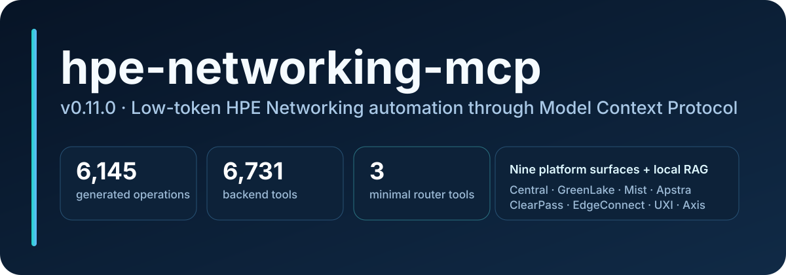

# hpe-networking-mcp — HPE Networking MCP toolkit

[](LICENSE)
[](https://www.python.org/)
[](https://modelcontextprotocol.io/)
[](https://github.com/secure-ssid/hpe-networking-mcp/actions/workflows/ci.yml)
[](https://secure-ssid.github.io/hpe-networking-mcp/)
[](https://github.com/secure-ssid/hpe-networking-mcp/releases)
[](https://github.com/secure-ssid/hpe-networking-mcp/pkgs/container/hpe-networking-mcp)



The banner tracks the current backend catalog: a large tool surface stays
available on demand, while the MCP client itself only ever sees three router
tools by default.

**Low-token Model Context Protocol (MCP) server for HPE Networking automation: Aruba Central, HPE GreenLake Platform (GLP), ClearPass, Juniper Mist, Apstra, ArubaOS 8 migration automation, EdgeConnect, HPE Aruba UXI, and Axis Atmos Cloud.**

MCP lets an AI client — Claude Code, Copilot, Cursor, VS Code, or any other
MCP-capable host — call into a common toolbox instead of a bespoke plugin per
vendor. `hpe-networking-mcp` is one such server: point any MCP client at it and
it exposes a searchable catalog of HPE networking operations behind a small,
low-token surface.

hpe-networking-mcp gives MCP-capable AI clients a low-token way to search Aruba/HPE
docs, look up exact OpenAPI details, inspect Central health, run
troubleshooting workflows, manage configuration, execute guarded ArubaOS 8
migrations, and use guarded GreenLake Platform operations. It is built around
direct REST calls with `httpx`.

For the full visual walkthrough of this same information — audience picker,
diagrams, and write-safety flow — see the
[hpe-networking-mcp GitHub Pages site](https://secure-ssid.github.io/hpe-networking-mcp/).
This README stays intentionally short; canonical guides live under `docs/`.

## Why the router matters

Point your MCP client at **one** server: `src/hpe_networking_mcp/mcp_servers/tool_router.py`. The
recommended `minimal` profile keeps the client-visible tool list at three
entries while still reaching the full backend catalog:

1. `find_tool` — discover the right backend tool.
2. `invoke_read_tool` — dispatch read-only calls.
3. `invoke_tool` — dispatch intentional write/destructive calls only.

## Who it's for

| You are... | Start with |
|---|---|
| A first-time MCP user | The [five-minute credential-free quickstart](#five-minute-credential-free-quickstart) below, then [Getting started](docs/getting-started.md) |
| An Aruba network operator | [Example prompts](docs/example-prompts.md) and [typed product workflows](docs/product-workflows.md) |
| An hpe-networking-mcp developer | [How MCP and RAG work](docs/architecture/how-it-works.md), [Architecture overview](docs/architecture/system-overview.md), [Releases](docs/releases.md), and [Contributing guide](CONTRIBUTING.md) |

## Five-minute credential-free quickstart

Verify the install and start the MCP HTTP server before adding any Aruba
Central or GreenLake Platform credentials.

**What each option gives you, before you pick:**

| What you get | Option A — published image | Option B — source checkout |
|---|---|---|
| Router tools + exact-API lookup (`lookup_api`; spec index baked into the image) | Yes | Yes |
| Prose docs RAG (`search_docs` / `ask_docs`) | **Not included** — needs an `INSTALL_EXTRAS=ingestion` rebuild *plus* a corpus you fetch and build yourself ([end-to-end checklist](docs/production-deployment.md#building-a-rag-capable-image)) | The same two pieces: the `ingestion` extra, plus the same self-built corpus |
| Guided first run (`scripts/setup_wizard.py`) | No — the container starts straight into the router | Yes |

**Option A — pull the published image (no checkout):**

```bash
docker run -d --name hpe-networking-mcp \
  -p 127.0.0.1:8010:8010 \
  -e MCP_HOST=0.0.0.0 \
  -e MCP_ALLOWED_HOSTS='127.0.0.1:*,localhost:*' \
  -e MCP_ALLOWED_ORIGINS='http://127.0.0.1:*,http://localhost:*' \
  ghcr.io/secure-ssid/hpe-networking-mcp:latest
```

Once startup finishes (seconds), `curl http://127.0.0.1:8010/livez` answers
`{"status":"ok"}`. The loopback-only publish keeps the server off your LAN;
the `host:*` allowlist form is required whenever `MCP_HOST` is not loopback.
The image ships the OpenAPI spec index baked at build time; semantic search
ranking additionally wants an ingestion-extra rebuild
(`--build-arg INSTALL_EXTRAS=ingestion`, see
[Production deployment](docs/production-deployment.md)).

**Option B — build from source** (adds the setup wizard, doctor diagnostics,
and local index tooling):

```bash
git clone https://github.com/secure-ssid/hpe-networking-mcp.git
cd hpe-networking-mcp
python3 scripts/setup_wizard.py --yes --skip-credentials
uv run hpe-mcp-doctor
MCP_PORT=8010 bash scripts/run_http_router.sh
```

Expected outcomes:

- The wizard prints each completed phase and ends with a setup-complete summary; no Central/GLP calls are made. On Windows hosts, build and run from a shell with LF line endings (WSL2 or a configured checkout) — CRLF checkouts break the entry scripts inside Docker builds.
- `doctor.py` reports local dependency, config-path, and index checks — everything reads `OK` or lists what to fix, without calling any vendor API.
- The HTTP router prints a `Uvicorn running on http://127.0.0.1:8010` line and keeps running in the foreground.

<figure>
  
  <figcaption>The six steps in this diagram — clone, run the wizard, check the doctor, connect, discover, and call safely — are exactly what the commands above walk through.</figcaption>
</figure>

Connect any MCP-capable client to `http://127.0.0.1:8010/mcp`, then try a
credential-free discovery call:

```text
find_tool("list Aruba Central devices")
```

Expected outcome: ranked matches read straight from the local tool index the
wizard just built, each annotated with its capability and write-gate state.
No vendor API is contacted.

### Connect it in your client

Point any MCP-capable client at `http://127.0.0.1:8010/mcp` (or a stdio
`hpe-mcp-router` config) and it sees just the three router tools. Copy/paste
configs for Claude, Copilot, VS Code, Cursor, and others live in
[MCP client recipes](docs/mcp-client-recipes.md); the shipped examples are
under [`examples/mcp-clients/`](examples/mcp-clients/).

### Documentation search is a separate, local build

`ask_docs` and the rest of the RAG surface need a prose corpus that this
project deliberately does **not** ship. That corpus is scraped vendor
documentation, and republishing it is not ours to do — see
`ingestion/source_manifest.json`, which has always said "Do not commit scraped
content". Build it yourself, under your own acceptance of each vendor's terms:

```bash
uv run --extra ingestion python ingestion/ingest_docs.py
```

Budget for it. The crawl is measured in hours, and the first RAG query
additionally downloads the ~250 MB `nomic-embed-text-v1.5` embedding model
into your Hugging Face cache. **Credential-free is not the same as offline:**
the quickstart above needs no vendor credentials, but the corpus build and
first query both need network access.

## Write safety at a glance

- `find_tool` only searches the local tool catalog; it never calls a vendor API.
- `invoke_read_tool` blocks any backend tool that is not annotated read-only.
- `invoke_tool` is deliberately marked destructive because it can also dispatch write/destructive backend tools — use it only when a write is intended.
- Use `dry_run=True` first when supported; real execution then requires either `confirm=True` or MCP elicitation, depending on the tool schema.
- Writes are opt-in on every platform, Central included: under the default `HPE_MCP_ACCESS_PROFILE=custom` each platform's write gate stays closed until you set it. Use `safe-read-only` to block every write regardless of the per-platform gates, or `full-read-write` to enable ordinary writes on every loaded platform.
- Full read/write mode does not bypass dry-run, confirmation, elicitation, or dedicated safeguards such as the separate AOS8 rollback gate.
- Credentials stay in `config/credentials.yaml` or environment variables and are never committed.

| Variable | Default | Effect |
|---|---|---|
| `HPE_MCP_ACCESS_PROFILE` | `custom` | `safe-read-only` denies all writes; `full-read-write` allows all; `custom` uses per-platform gates below |
| `HPE_MCP_<PLATFORM>_WRITES` | `0` | Set `1` to expose that platform's write **and destructive** tools |

Destructive operations (`reboot_device`, `disconnect_client`) are gated by the
same flag as writes — there is no separate "operational" tier that bypasses it.

See [Tool router](docs/tool-router.md) for the complete discovery/dispatch/write-safety model.

## Project snapshot

| Area | Current snapshot |
|---|---|
| Tool catalog | Non-additive profiles: 380 core tools / 2842 read-only optional starters / 5822 read-write optional starters; REST/OpenAPI platform API backend total: 6,711; protocol-only Central Streaming: 1; cross-platform site-health: 1; complete backend index: 6,728; direct-all: 6,736 |
| Capability totals (platform APIs) | 3,159 read / 165 diagnostic / 2,545 write / 842 destructive |
| RAG | 392,471 prose chunks in LanceDB across 30 scraped sources |
| Structured lookup | 2,734 endpoints, 6,363 schemas, 31,432 fields, 104 advisories, 345 lifecycle records |
| API provenance | Aruba ReadMe registries, official Mist/Apstra sources, pinned GLP and EdgeConnect snapshots, SHA-pinned Axis generator |
| Optional platforms | ClearPass, Mist, Apstra, AOS8, EdgeConnect, UXI, Axis Atmos Cloud, plus the credential-free `design` diagram tools |
| Safety | Per-platform write gates, dry-run + confirmation, HTTP host/origin and bearer controls, credential-gated live-test config |

Full per-backend counts live in [Tool catalog](docs/tool-catalog.md). The
latest published (tagged) release is [0.8.0](docs/release-notes-0.8.0.md).
[0.10.0 notes](docs/release-notes-0.10.0.md) describe in-tree `main`;
[0.9.0](docs/release-notes-0.9.0.md) is archived. See the
[capability gap matrix](docs/capability-gap-matrix.md)
for reproducible tool/benchmark comparisons.

## Task-oriented guides

| Need | Guide |
|---|---|
| Full setup, credentials, and MCP client connection | [Getting started](docs/getting-started.md) |
| Run the published image or Compose overlay (GHCR) | [Production deployment](docs/production-deployment.md) |
| Copy/paste stdio or streamable HTTP client config | [MCP client recipes](docs/mcp-client-recipes.md) |
| Router modes, toolsets, and safe dispatch in depth | [Tool router](docs/tool-router.md) |
| Real prompts with expected call shapes | [Example prompts](docs/example-prompts.md) |
| Enable ClearPass, Mist, Apstra, AOS8, EdgeConnect, UXI, or Axis | [Optional product starters](docs/optional-products.md) |
| Typed product-specific workflow roadmap | [Product workflows](docs/product-workflows.md) |
| Fix setup, credential, HTTP, or catalog issues | [Troubleshooting](docs/troubleshooting.md) |
| Architecture, data flow, and safety diagrams | [System overview](docs/architecture/system-overview.md) |
| Every backend's tool counts and coverage | [Tool catalog](docs/tool-catalog.md) |
| The complete task-based visual gateway | [hpe-networking-mcp GitHub Pages](https://secure-ssid.github.io/hpe-networking-mcp/) |
| Every documentation page, grouped by purpose | [docs/README.md](docs/README.md) |
| Migrating from `secure-ssid/centralmcp` | [MIGRATION.md](MIGRATION.md) |
| Contribute, get support, or report a security issue | [CONTRIBUTING.md](CONTRIBUTING.md), [SUPPORT.md](SUPPORT.md), [SECURITY.md](SECURITY.md) |
| Understand what data the server collects and where it goes | [PRIVACY.md](PRIVACY.md) |
| Version history | [CHANGELOG.md](CHANGELOG.md) |

## Local setup essentials

The default MCP client profile stays lean:

```env
HPE_MCP_ROUTER_MODE=minimal
HPE_MCP_TOOLSETS=central,glp,rag
```

Enable optional products only when needed:

```env
HPE_MCP_ACCESS_PROFILE=custom
HPE_MCP_PRODUCTS=clearpass,mist,apstra,aos8,edgeconnect,uxi,axis,design
HPE_MCP_PRODUCT_ACCESS=read-only
```

| Product | Variables |
|---|---|
| ClearPass | `CLEARPASS_BASE_URL`, `CLEARPASS_API_TOKEN` |
| Juniper Mist | `MIST_HOST`, `MIST_API_TOKEN` |
| Apstra | `APSTRA_BASE_URL`, preferred `APSTRA_USERNAME`/`APSTRA_PASSWORD`, optional `APSTRA_API_TOKEN` |
| ArubaOS 8 | `AOS8_BASE_URL`, preferred `AOS8_USERNAME`/`AOS8_PASSWORD`, optional `AOS8_API_TOKEN`, optional `AOS8_CLIENT_IP`, optional `AOS8_SESSION_TTL_SECONDS` |
| EdgeConnect | `EDGECONNECT_BASE_URL`, `EDGECONNECT_API_TOKEN`, optional `EDGECONNECT_AUTH_HEADER`, endpoint-specific `EDGECONNECT_AI_SESSION_AUTHORIZATION` |
| HPE Aruba UXI | `UXI_CLIENT_ID`, `UXI_CLIENT_SECRET`, optional `UXI_BASE_URL`, optional `UXI_TOKEN_URL` |
| Axis Atmos Cloud | `AXIS_BASE_URL`, `AXIS_API_TOKEN` |
| Network design diagrams (Draw.io / Graphviz / NeXt) | none required; optional `HPE_MCP_DIAGRAM_ICON_DIR` |

See the [optional product matrix](docs/optional-products.md) for the full setup
and safety model.

For a trusted, fully write-capable session, use
`python3 scripts/setup_wizard.py --access-profile full-read-write` so all
legacy gates are aligned, or use the self-contained
[`examples/mcp-clients/stdio/full-read-write.mcp.json`](examples/mcp-clients/stdio/full-read-write.mcp.json).

`.claude/launch.json` ships a matching minimal `hpe-networking-mcp` launch
profile for daily use. `find_tool` omits full JSON schemas by default; request
`include_schema=true` only when a client needs the full parameter shape.

Build or refresh the router tool index and the API-spec database. Both are
derived from the OpenAPI specs committed to this repository, so they rebuild
deterministically and need no scraping:

```bash
uv run python scripts/ingest_tools.py --products all
```

The RAG prose corpus is built separately by `ingestion/ingest_docs.py`, as
described in the quickstart above. It is not distributed as a release asset.

See [Getting started](docs/getting-started.md) for credentials, region
selection, optional-product env vars, and the full ingestion/refresh path.

## Streamable HTTP mode

```bash
MCP_PORT=8010 bash scripts/run_http_router.sh
```

Then point any MCP-capable client at `http://127.0.0.1:8010/mcp`. The server
also exposes `/livez`, `/readyz`, and `/healthz`. Non-loopback binds require
explicit `MCP_ALLOWED_HOSTS`/`MCP_ALLOWED_ORIGINS` and can be protected with
`MCP_HTTP_BEARER_TOKEN`. See [MCP client recipes](docs/mcp-client-recipes.md)
for copy/paste stdio and HTTP configs.

## Project layout

```text
src/hpe_networking_mcp/mcp_servers/     Low-token router + Central/GLP/RAG/optional-product servers
src/hpe_networking_mcp/pipeline/        httpx clients, 8-stage migration pipeline, SSID helpers
ingestion/       Docs/API scraping and LanceDB + SQLite index builders
docs/            Setup, router, architecture, product, and release guides
scripts/         Setup wizard, doctor wrapper, HTTP router helper, release validation
tests/           Unit, integration, and RAG eval coverage
config/          Credentials template; real credentials stay git-ignored
examples/        Tested, non-secret MCP client/prompt/runbook configuration examples
run_pipeline.py  Checkout wrapper for `hpe-mcp-run-pipeline`
run_ssid.py      Checkout wrapper for `hpe-mcp-run-ssid`
```

The full repository map, including generated/git-ignored paths, lives in
[System overview](docs/architecture/system-overview.md#repository-map).

## Validation

```bash
uv run pytest tests/unit -q
uv run python scripts/validate_release.py --catalog-products all --strict-tool-index --min-tools 6711
```

`--min-tools 6711` is the platform API compatibility floor (the
6,711 vendor-facing platform API tools), not the complete registered backend
total of 6,728, which also includes the protocol-only Central Streaming tool,
the cross-platform `site-health` aggregator, the local GLP preflight
diagnostic, and credential-free local tools — validation passes at or above
the floor. See
[Tool catalog](docs/tool-catalog.md) for both totals.

The release helper runs unit tests, optional RAG/API eval when indexes exist, tool catalog floor checks, and local tool-index freshness checks. Unit tests also include static guards for the active MCP/pipeline code, committed low-token MCP config examples, local-only config files, router product/toolset docs, bounded generic read-only GET tools, MCP list default bounds, RAG/search top_k bounds, public tool-count claims, tool-count docstrings, rendered RAG/index doc-fact claims, tracked Markdown local links and images, Pages sitemap and robots metadata, documented router example arguments, product workflow tool-name tables, and wizard optional-product env tables.

## Related projects and thanks

hpe-networking-mcp is an independent HPE Networking MCP toolkit, improved by watching
the official MCP ecosystem and community work:

- [HewlettPackard/gl-mcp](https://github.com/HewlettPackard/gl-mcp) - official GreenLake Platform MCP server
- [modelcontextprotocol/python-sdk](https://github.com/modelcontextprotocol/python-sdk) - MCP Python SDK
- [KarthikSKumar98/central-mcp-server](https://github.com/KarthikSKumar98/central-mcp-server) - community Aruba Central MCP server
- [nowireless4u/hpe-networking-mcp](https://github.com/nowireless4u/hpe-networking-mcp) - unified HPE networking MCP reference

## Disclaimer

hpe-networking-mcp is an independent community project. It is not an official HPE or
HPE Aruba Networking product and is not endorsed by or supported by HPE.

## License

MIT - see the [repository license](LICENSE). Generated API metadata and
upstream implementation references are documented in
[THIRD_PARTY_NOTICES.md](THIRD_PARTY_NOTICES.md).
