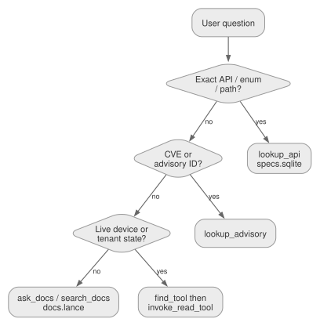

# How MCP and RAG work

This is the current mental model for hpe-networking-mcp. Counts come from
[`docs/project-facts.json`](../project-facts.json). Historical design notes
live in [system overview](system-overview.md) and
[RAG architecture](RAG-ARCHITECTURE.md).

<figure class="docs-figure">
  
  <figcaption>The client only sees discovery and dispatch. RAG answers docs/API questions locally. Live Central/GLP tools run only after find_tool selects them.</figcaption>
</figure>

## What the MCP client sees

The recommended profile is:

```env
HPE_MCP_ROUTER_MODE=minimal
HPE_MCP_TOOLSETS=central,glp,rag
```

That profile publishes three router tools:

| Tool | Job |
|---|---|
| `find_tool` | Search the local tool catalog. No vendor API call. |
| `invoke_read_tool` | Run a read-only backend tool. Refuses writes and destructive tools. |
| `invoke_tool` | Dispatch any enabled backend tool. Marked destructive because it can reach writes. |

The catalog behind those three tools currently holds **6,722** registered
backend tools and **6,144** generated OpenAPI operations. Direct-all mode
exposes **6,729** client-visible tools and is for debugging, not daily use.

## Two kinds of answers

Ask the indexes first for knowledge. Ask live APIs only for tenant/device
state.

| Question type | First tool | Store | Network |
|---|---|---|---|
| Exact endpoint, schema, enum, `operationId` | `lookup_api` | `data/specs.sqlite` | none |
| CVE / vendor advisory ID | `lookup_advisory` | SQLite advisory tables | none |
| How-to, concepts, design guidance | `ask_docs` or `search_docs` | `data/docs.lance` | none |
| Which MCP tool should I call? | `find_tool` | `data/tools.lance` | none |
| Live health, alerts, inventory, config | `find_tool` then `invoke_read_tool` | vendor APIs | yes |
| Write / reboot / bounce / resync | `find_tool` then `invoke_tool` | vendor APIs | yes, gated |

<figure class="docs-figure">
  
  <figcaption>API-shaped questions stay on exact SQLite lookup. Prose uses hybrid LanceDB search. Live device state never comes from RAG.</figcaption>
</figure>

`ask_docs` already does that routing internally: a literal CVE/advisory ID
goes to `lookup_advisory`, an API-shaped question goes to `lookup_api`, and
only then does it fall back to prose RAG.

## How RAG is built

Official sources are scraped into `ingestion/sources/` (git-ignored), then
ingested into local indexes under `data/` (also git-ignored). Prebuilt
indexes ship as GitHub Release assets.

<figure class="docs-figure">
  
  <figcaption>Prose, OpenAPI, advisories, and tool definitions use different stores so each query uses the most reliable path.</figcaption>
</figure>

| Index | File | Used by |
|---|---|---|
| Hybrid prose docs | `data/docs.lance` | `search_docs`, `ask_docs` |
| Exact OpenAPI + advisories | `data/specs.sqlite` | `lookup_api`, `lookup_advisory`, lifecycle tools |
| Tool catalog | `data/tools.lance` | `find_tool` |

Default embeddings are in-process **fastembed** (`nomic-embed-text-v1.5`).
No Docker, Redis, or Ollama is required to clone and run. Redis Stack remains
an optional server backend.

The current corpus is **392,471** prose chunks, **4,106** endpoints,
**8,890** schemas, **50,675** fields, **104** advisories, and **345**
lifecycle records across **16** declared RAG sources.

## How a live call runs

1. `find_tool("critical alerts")` searches the catalog and returns compact
   schema plus safety metadata.
2. Reads go through `invoke_read_tool`. Diagnostics/writes go through
   `invoke_tool`.
3. The router validates arguments, forwards them to the owning backend
   (`central-monitoring`, `glp-core`, `rag-core`, ...), and bounds the
   response.

<figure class="docs-figure">
  
  <figcaption>Discovery never calls a vendor API. Dispatch does, only after the tool and arguments are selected.</figcaption>
</figure>

Protocol-only Central Streaming is not a REST/OpenAPI wrapper. It is a
bounded WebSocket collector (`central_collect_streaming_events`) with
subscription preflight, reconnect limits, and redaction.

## Write safety

<figure class="docs-figure">
  
  <figcaption>Reads run immediately. Writes need a dry-run preview, a platform write gate, and confirm or elicitation.</figcaption>
</figure>

- **Dry run** previews the payload and makes no vendor call.
- **Gated** means the platform write switch must be on
  (`HPE_MCP_CENTRAL_WRITES`, `HPE_MCP_GLP_V2BETA1_WRITES`, and the other
  platform gates).
- **Confirm / elicitation** is required before a real write or destructive
  action.
- Planning tools (`plan_device_troubleshooting`, `plan_site_troubleshooting`,
  `plan_config_health_remediation`) are read-only. They recommend next tools
  with `execute=False`. They do not reboot, bounce, or resync anything.

## What loads by default

| Surface | Default | Notes |
|---|---|---|
| `central-*` monitoring/config/ops/NAC | on with `central` toolset | Live Aruba Central REST |
| `central-streaming` | on with Central | Protocol-only WSS collector |
| `glp-core` | on with `glp` toolset | GreenLake Platform + local `glp_preflight` |
| `rag-core` | on with `rag` toolset | Local indexes only |
| `interop-core` | always | Credential-free Central ↔ Mist translation |
| ClearPass, Mist, Apstra, AOS8, EdgeConnect, UXI, Axis, design | opt-in | `HPE_MCP_PRODUCTS` / `HPE_MCP_TOOLSETS` |

Keep optional products off unless you need them. That is how the client
token budget stays small.

## Next reading

| If you need | Read |
|---|---|
| Runtime, transport, and repository map | [System overview](system-overview.md) |
| Retrieval design, eval, and provenance | [RAG architecture](RAG-ARCHITECTURE.md) |
| Router modes and write contracts | [Tool router](../tool-router.md) |
| Per-backend counts | [Tool catalog](../tool-catalog.md) |
| Client setup | [Getting started](../getting-started.md) |
