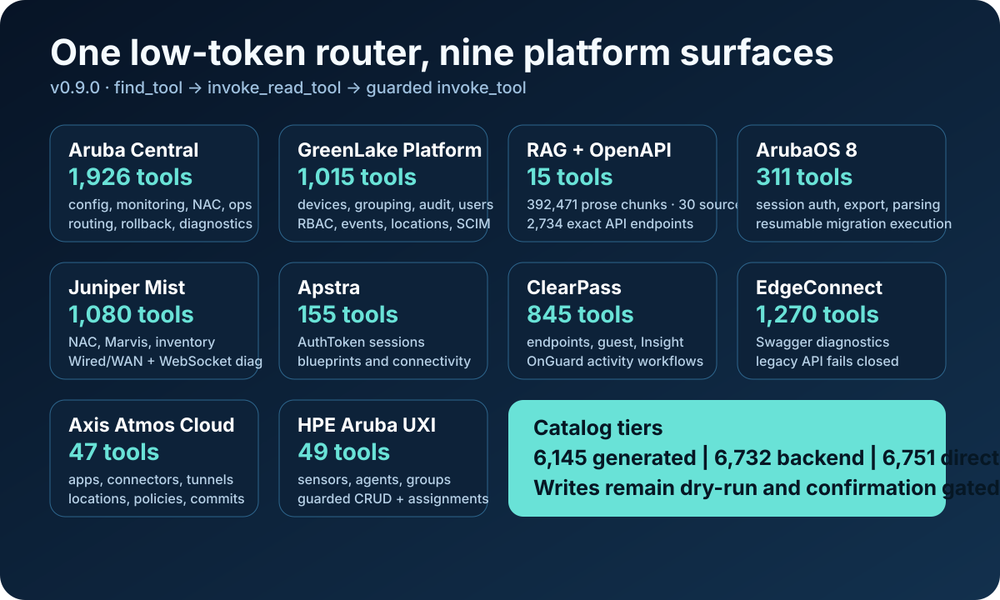
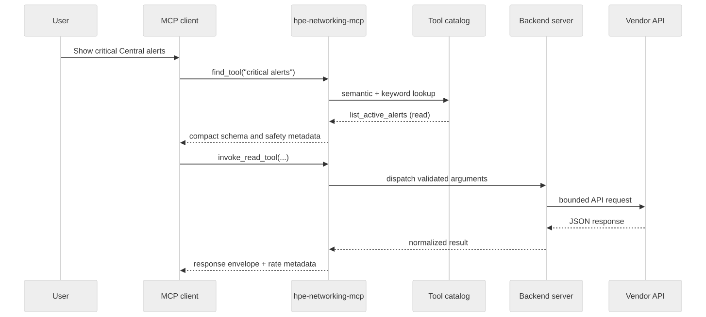
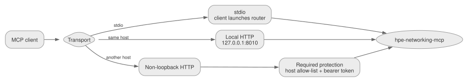

# hpe-networking-mcp system overview

For the current mental model — three router tools, RAG vs live APIs, dry-run
and write gates, and read-only planners — start with
[How MCP and RAG work](how-it-works.md). This page is the runtime map.

hpe-networking-mcp places a small MCP router in front of Aruba Central, GreenLake,
documentation indexes, and opt-in product backends. Users discover a capability
first, then dispatch the selected tool through a read-only or guarded write
path.

<figure class="docs-figure">
  
  <figcaption>The client sees a compact router surface while the router reaches the larger backend catalog only when needed.</figcaption>
</figure>

## Runtime in one screen

| Layer | Responsibility |
|---|---|
| MCP client | Sends natural-language tasks and tool calls over stdio or streamable HTTP |
| `hpe-networking-mcp` | Discovers tools, validates dispatch, applies safety rules, and bounds responses |
| Core backends | Central monitoring/config/ops/NAC, Central Streaming (WSS), GreenLake Platform, and RAG |
| Always-on local | `interop-core` Central ↔ Mist translation (no vendor credentials) |
| Optional backends | ClearPass, Mist, Apstra, ArubaOS 8, EdgeConnect, UXI, Axis, and design when enabled |
| Local indexes | Hybrid documentation retrieval, exact OpenAPI/advisory lookup, and semantic tool discovery |
| Vendor APIs | External REST systems reached by async HTTP clients; Streaming uses a bounded WSS collector |

## Client boundary

The router is model-agnostic: VS Code/Copilot, Copilot CLI, Claude, Crush,
MCPJam, LibreChat, and Open WebUI own model selection, chat memory, and host
approval UX. The standalone `hpe-mcp` client is an optional local fallback
with heuristic, OpenAI-compatible, Anthropic, and Ollama adapters; it exposes
bounded activity and tool results rather than hidden chain-of-thought. Keep
the router focused on discovery, dispatch, safety, and transport.

The normal MCP profile keeps the client-visible surface small:

```env
HPE_MCP_ROUTER_MODE=minimal
HPE_MCP_TOOLSETS=central,glp,rag
```

Optional products are disabled until explicitly enabled:

```env
HPE_MCP_PRODUCTS=clearpass,mist,apstra,aos8,edgeconnect,uxi,axis,design
```

The full catalog contains 6,144 generated operations and 6,726 backend tools
when every platform and guarded write is indexed. Minimal mode exposes only
`find_tool`, `invoke_read_tool`, and `invoke_tool` to the MCP client.



## Tool discovery and dispatch

<figure class="docs-figure">
  
  <figcaption>Discovery returns the tool schema and safety metadata before any backend operation runs.</figcaption>
</figure>

Use `invoke_read_tool` for normal investigations. Use `invoke_tool` only when the user intentionally asks for a write or destructive action; it is marked destructive because it can dispatch any enabled backend tool.

## Write-safety enforcement

<figure class="docs-figure">
  
  <figcaption>Writes require the correct dispatcher and platform gates; destructive operations also require an explicit preview and confirmation.</figcaption>
</figure>

<div class="docs-callout docs-callout--safe" markdown="1">
**Access profiles:** `custom` preserves the existing mixed platform gates,
`safe-read-only` blocks writes globally, and `full-read-write` enables ordinary
writes on every loaded platform. Dry-run, confirmation, elicitation, and
dedicated destructive safeguards remain in force.
</div>

## Documentation and index flow

<figure class="docs-figure">
  
  <figcaption>Prose retrieval, exact API lookup, and tool discovery use separate stores so each query follows the most reliable path.</figcaption>
</figure>

- `ask_docs` and `search_docs` use the hybrid documentation index.
- `lookup_api` reads parsed OpenAPI data from SQLite without lossy embedding.
- `find_tool` searches the tool catalog and returns compact schemas and safety
  metadata.
- Ingestion commands rebuild local artifacts under `data/`; those generated
  files are intentionally git-ignored.

## Transport and deployment

<figure class="docs-figure">
  
  <figcaption>stdio is simplest for desktop clients. Streamable HTTP supports shared processes, but non-loopback listeners must be protected.</figcaption>
</figure>

| Deployment | Configuration | Security boundary |
|---|---|---|
| stdio | Client launches `src/hpe_networking_mcp/mcp_servers/tool_router.py` | Local child process |
| Local HTTP | `MCP_TRANSPORT=streamable-http`, loopback listener | Same-host clients |
| Non-loopback HTTP | Streamable HTTP plus allowed hosts and bearer token | Explicit network and authentication controls |

See [MCP client recipes](../mcp-client-recipes.md) for copy/paste
configurations.

## Local setup and validation

`scripts/setup_wizard.py` can run install, offer common Central API gateway
choices, fill credentials without echoing secrets, and enable only the optional
products you choose. `scripts/doctor.py` is intentionally non-mutating and does
not call Central, GLP, or optional product APIs. It checks local dependencies,
credentials/config paths, indexes, RAG source-manifest drift, router profile
drift, HTTP URL/transport mismatches, optional product env, and listener status.

## Repository map

```text
.claude/                 Optional launch profiles and repo agent notes
.cursor/                 Cursor MCP profiles
.vscode/                 VS Code MCP example config
config/                  Credentials template
docs/                    User, architecture, setup, router, and product docs
ingestion/               Docs/API ingestion into LanceDB and SQLite
inputs/                  Example migration input templates
src/hpe_networking_mcp/mcp_servers/             MCPServer backends and low-token router
src/hpe_networking_mcp/pipeline/                Clients, migration stages, SSID helpers
resources/               API/Postman reference notes and resources
scripts/                 Local doctor, HTTP router helper, catalog ingest, release validation
tests/                   Unit, integration, and eval coverage

.mcp.json.example        Generic stdio MCP client example
.mcp.http.json.example   Generic streamable HTTP MCP client example
docker-compose.yml       Optional localhost-only Redis/Ollama server backend
run_pipeline.py          Checkout wrapper for `hpe-mcp-run-pipeline`
run_ssid.py              Checkout wrapper for `hpe-mcp-run-ssid`
```

Generated local artifacts are intentionally git-ignored:

```text
config/credentials.yaml
.env
.mcp.json
.mcp.http.json
data/
state/
outputs/
ingestion/sources/
ingestion/markdown*/
```

The optional Redis/Ollama Docker helper uses Docker named volumes for service
state, so it does not create repo-local `redis_data/` or `ollama_data/`
directories on new setups.

## Migration and source provenance

The AOS8 migration path is separate from the generic eight-stage CSV hpe_networking_mcp.pipeline.
It establishes UIDARUBA/X-CSRF sessions, exports WLANs, roles, VLANs, AP groups,
controllers, and policies, normalizes those objects, and produces separate
Classic Central and New Central candidates with warnings, deterministic diffs,
and read-only verification plans.

OpenAPI inputs are reproducible:

- Aruba reference pages resolve `oasPublicUrl` through 25 tracked ReadMe API
  registries.
- Mist API version 2606.1.1 is pinned from the official
  `mistsys/mist_openapi` repository and SHA-256 verified.
- Weekly CI checks detect registry hash or Mist upstream drift.
- Structured OpenAPI records are stored only in `data/specs.sqlite`; the
  392,471-row LanceDB table remains a prose retrieval corpus.

<div class="docs-next" markdown="1">
### Continue

- [How MCP and RAG work](how-it-works.md)
- [Set up hpe-networking-mcp](../getting-started.md)
- [Understand the router](../tool-router.md)
- [Explore optional products](../optional-products.md)
</div>
