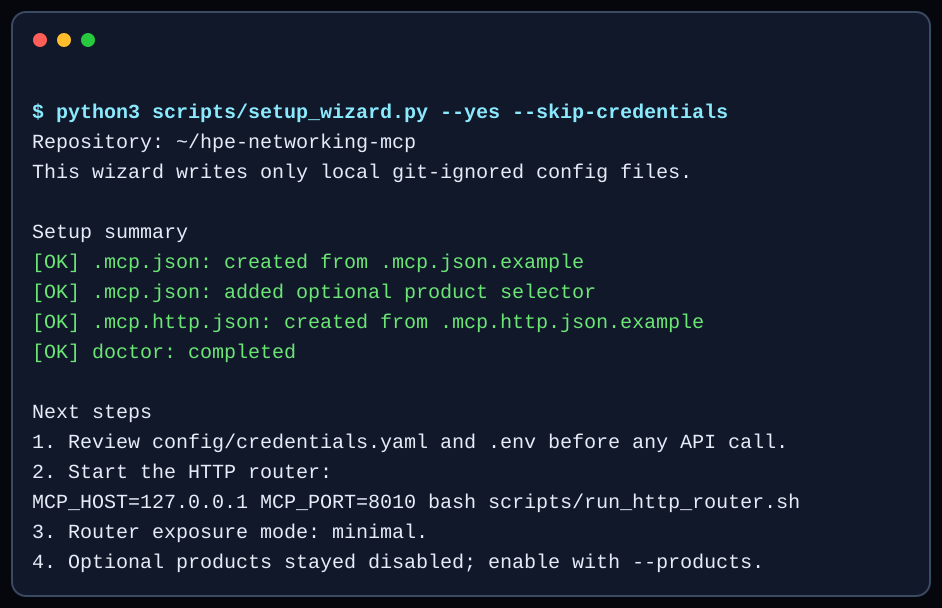
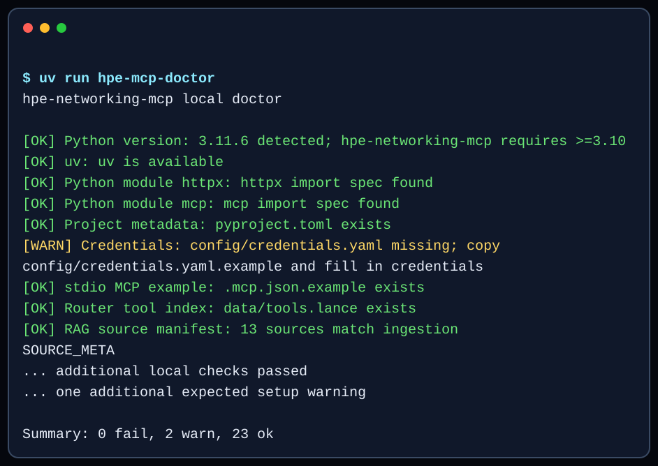
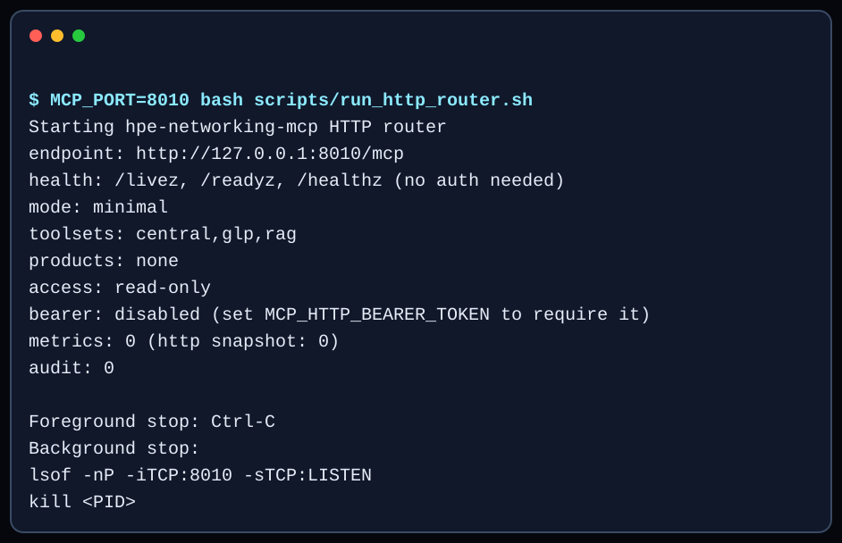

# Getting started

By the end of this guide you will have a local hpe-networking-mcp clone, a verified
local setup, a low-token MCP router running, an MCP client connected to it,
and one confirmed successful tool call. Every step below tells you exactly
what to expect before you move on.

<figure class="docs-figure">
  
  <figcaption>The quickstart journey: clone, run the setup wizard, check the
  local doctor, connect an MCP client over stdio or HTTP, discover a tool
  with <code>find_tool</code>, and call it safely with
  <code>invoke_read_tool</code>.</figcaption>
</figure>

<div class="journey-grid">
  <div class="journey-card" markdown="1">

### 1. Clone

Get the repository and its dependencies locally. See [Step 1](#1-install).

  </div>
  <div class="journey-card" markdown="1">

### 2. Run the wizard

`scripts/setup_wizard.py` installs, configures, and checks itself. See
[Step 2](#2-try-it-credential-free).

  </div>
  <div class="journey-card" markdown="1">

### 3. Check the doctor

`scripts/doctor.py` verifies local setup without calling any API. First run
it in [Step 2](#2-try-it-credential-free); re-run it any time, including
[Step 7](#7-validate-locally).

  </div>
  <div class="journey-card" markdown="1">

### 4. Connect a client

Point stdio or streamable HTTP at `hpe-networking-mcp`. See
[Step 4](#4-connect-your-mcp-client).

  </div>
  <div class="journey-card" markdown="1">

### 5. Discover a tool

Ask `find_tool` for the operation you need. See
[Step 6](#6-make-your-first-successful-call).

  </div>
  <div class="journey-card" markdown="1">

### 6. Call it safely

Dispatch with `invoke_read_tool` and read the response. See
[Step 6](#6-make-your-first-successful-call).

  </div>
</div>

## Prerequisites

<div class="step-grid">
  <div class="step-card" markdown="1">

### Python 3.10+

hpe-networking-mcp requires Python 3.10 or newer. `scripts/doctor.py` checks this for
you starting in [Step 2](#2-try-it-credential-free).

  </div>
  <div class="step-card" markdown="1">

### `uv` (recommended)

The lockfile is maintained for `uv`. It can install dependencies and run
scripts (`uv sync`, `uv run python ...`).

  </div>
  <div class="step-card" markdown="1">

### git

Used to clone the repository in [Step 1](#1-install).

  </div>
  <div class="step-card" markdown="1">

### An MCP-capable client

Cursor, VS Code, Claude, or any client that supports stdio or streamable HTTP
MCP servers. See [mcp-client-recipes.md](mcp-client-recipes.md).

  </div>
  <div class="step-card" markdown="1">

### Central / GLP credentials (optional at first)

Not required for [Step 2](#2-try-it-credential-free). Needed before any tool
call that reaches a live Aruba Central or GreenLake Platform API — see
[Step 3](#3-add-credentials).

  </div>
</div>

## 1. Install

```bash
git clone https://github.com/secure-ssid/hpe-networking-mcp.git
cd hpe-networking-mcp
python3 scripts/setup_wizard.py
```

The guided setup wizard can run `uv sync`, create local git-ignored config
files, replace MCP path placeholders, choose a Central API gateway region, fill
credentials without echoing secrets, enable optional products, build the router
tool catalog, and run the local doctor.

Installing the project also puts four console commands on your `PATH`:

| Command | What it does |
|---|---|
| `hpe-mcp-router` | Run the unified `hpe-networking-mcp` MCP router (transport from `MCP_TRANSPORT`) |
| `hpe-mcp-doctor` | Local setup diagnostic; no Central/GLP API calls |
| `hpe-mcp-run-pipeline` | Switch migration pipeline CLI |
| `hpe-mcp-run-ssid` | Underlay/overlay SSID builder CLI |

Prefer these over the `run_pipeline.py` / `run_ssid.py` / `scripts/doctor.py`
wrappers at the repository root -- those exist only so a raw, not-yet-installed
checkout still works.

If dependencies are already installed, or you want to skip any wizard phase:

```bash
python3 scripts/setup_wizard.py --skip-install
```

<div class="docs-checkpoint">
  <span class="docs-checkpoint__number">1</span>
  <div class="docs-checkpoint__body" markdown="1">

**Checkpoint:** the wizard prints a `[status] label: detail` line for each
phase it runs, ending with a summary count. If any phase fails, re-run with
`--skip-install` after resolving the printed detail, or continue to Step 2 to
verify setup independently with the local doctor.

  </div>
</div>

<figure class="docs-figure">
  
  <figcaption>The generated terminal example shows the completion pattern. Keep using the copyable command above; exact phase counts can vary by selected options.</figcaption>
</figure>

## 2. Try it credential-free

You can verify dependencies, build the local router catalog, and start the
HTTP MCP server before adding Central or GLP credentials:

```bash
python3 scripts/setup_wizard.py --yes --skip-credentials
uv run hpe-mcp-doctor
```

Expect output similar to this (exact counts vary by local setup):

```text
hpe-networking-mcp local doctor

[OK] Python version: 3.11.6 detected; hpe-networking-mcp requires >=3.10
[OK] uv: uv is available
[OK] Python module httpx: httpx import spec found
[OK] Python module mcp: mcp import spec found
[WARN] Credentials: config/credentials.yaml missing; copy
  config/credentials.yaml.example to config/credentials.yaml and fill in
  credentials
[OK] stdio MCP example: .mcp.json.example exists
[WARN] Local stdio MCP config: copy .mcp.json.example to .mcp.json for local
  stdio clients
[OK] Router tool index: data/tools.lance exists

... additional local checks passed

Summary: 0 fail, 2 warn, 23 ok
```

`WARN` lines are expected before you add credentials or copy the local client
configs — they turn into `OK` in later steps. A `FAIL` line means something
needs fixing before you continue.

<figure class="docs-figure">
  
  <figcaption>The doctor remains local and non-mutating. The text block above is copyable and explains why credential warnings are expected during this trial.</figcaption>
</figure>

Now start the router itself:

```bash
MCP_PORT=8010 bash scripts/run_http_router.sh
```

Expect a startup banner like:

```text
Starting hpe-networking-mcp HTTP router
  endpoint: http://127.0.0.1:8010/mcp
  health:   http://127.0.0.1:8010/livez, /readyz, /healthz (no auth, no MCP negotiation)
  mode:     minimal
  toolsets: central,glp,rag
  products: none
  profile:  custom
  optional: read-only
  bearer:   disabled (set MCP_HTTP_BEARER_TOKEN to require a shared secret)
  metrics:  0 (http snapshot: 0)
  audit:    0

Foreground stop: Ctrl-C
Background stop:
  lsof -nP -iTCP:8010 -sTCP:LISTEN
  kill <PID>
```

<figure class="docs-figure">
  
  <figcaption>The startup banner makes the endpoint, enabled toolsets, product access mode, and stop procedure visible before a client connects.</figcaption>
</figure>

<div class="docs-callout docs-callout--info" markdown="1">

**Expected result:** the health routes never touch Central or GLP, so they
work even without credentials. `/readyz` reports `not_ready` until credentials
exist — that is the correct signal at this point, not a bug:

```bash
curl -s http://127.0.0.1:8010/readyz
```

```json
{"status": "not_ready", "detail": {"creds_path": "config/credentials.yaml", "creds_path_exists": false}}
```

</div>

<div class="docs-callout docs-callout--warning" markdown="1">

Plain `curl` requests to `/mcp` are expected to fail — MCP over streamable
HTTP requires session negotiation and `Accept: text/event-stream`:

```bash
curl -s -i -X POST http://127.0.0.1:8010/mcp \
  -H "Content-Type: application/json" \
  -d '{"jsonrpc":"2.0","id":1,"method":"ping"}'
```

```text
HTTP/1.1 406 Not Acceptable
{"jsonrpc":"2.0","id":"server-error","error":{"code":-32600,"message":"Not Acceptable: Client must accept both application/json and text/event-stream"}}
```

That 406 confirms the router is listening. Use a real MCP client (Step 4) for
actual tool calls — see [mcp-client-recipes.md](mcp-client-recipes.md) for
transport details.

</div>

Stop the foreground server with `Ctrl-C`. If you started it in the background
and need to stop it:

```bash
lsof -nP -iTCP:8010 -sTCP:LISTEN
kill <PID>
```

## 3. Add credentials

The wizard creates `config/credentials.yaml` when it is missing and offers common
Central API gateway choices:

| Region / gateway | Base URL |
|---|---|
| US / common API gateway | `https://apigw-prod2.central.arubanetworks.com` |
| EU Central | `https://apigw-eucentral3.central.arubanetworks.com` |
| APAC | `https://apigw-apac.central.arubanetworks.com` |
| Legacy/internal gateway | `https://internal.api.central.arubanetworks.com` |
| Custom | Enter the tenant-specific URL from your Central portal/API docs |

To create the template manually:

```bash
cp config/credentials.yaml.example config/credentials.yaml
```

Fill in the preferred sections with your own (fake values shown here):

```yaml
central_account:
  base_url: https://apigw-prod2.central.arubanetworks.com
  client_id: YOUR_CENTRAL_CLIENT_ID
  client_secret: YOUR_CENTRAL_CLIENT_SECRET
  glp_workspace_id: YOUR_GLP_WORKSPACE_ID

glp_account:
  base_url: https://apigw-prod2.central.arubanetworks.com
  client_id: YOUR_GLP_CLIENT_ID
  client_secret: YOUR_GLP_CLIENT_SECRET
  glp_workspace_id: YOUR_GLP_WORKSPACE_ID
```

<div class="docs-callout docs-callout--danger" markdown="1">

`config/credentials.yaml` is git-ignored — never commit real credentials.
Environment variables override YAML values, so a stray exported variable can
silently win over the file. Common overrides:

| Variable | Purpose |
|---|---|
| `SOURCE_BASE_URL`, `SOURCE_CLIENT_ID`, `SOURCE_CLIENT_SECRET` | Central/source account |
| `TARGET_BASE_URL`, `TARGET_CLIENT_ID`, `TARGET_CLIENT_SECRET` | GLP/target account |
| `SOURCE_GLP_WORKSPACE`, `TARGET_GLP_WORKSPACE` | Workspace IDs |
| `GLP_TOKEN_URL`, `GLP_BASE_URL` | GLP endpoint overrides |
| `TOKEN_CACHE_DIR` | Token cache directory |

</div>

<div class="docs-checkpoint">
  <span class="docs-checkpoint__number">2</span>
  <div class="docs-checkpoint__body" markdown="1">

**Checkpoint:** re-run the doctor and the readiness probe. `Credentials`
should now read `OK`, and `/readyz` should flip to `ok`:

```bash
uv run hpe-mcp-doctor
curl -s http://127.0.0.1:8010/readyz
```

```json
{"status": "ok", "detail": {"creds_path": "config/credentials.yaml", "creds_path_exists": true}}
```

  </div>
</div>

## 4. Connect your MCP client

```bash
cp .mcp.json.example .mcp.json
```

The wizard does this and replaces `/path/to/hpe-networking-mcp` with your local clone
path. If configuring manually, edit `.mcp.json` yourself. Recommended default
in that file:

```env
HPE_MCP_ROUTER_MODE=minimal
HPE_MCP_TOOLSETS=central,glp,rag
```

This exposes only the router discovery/dispatch surface and keeps tool-list
token cost low. The router can search 6,716 backend tools when all platforms
and guarded writes are indexed, while minimal mode exposes only three
client-visible tools: `find_tool`, `invoke_read_tool`, and `invoke_tool`.

Your client can either launch the router itself (stdio) or connect to one
already running (streamable HTTP, from [Step 2](#2-try-it-credential-free)).
[mcp-client-recipes.md](mcp-client-recipes.md) has the full decision guide and
copy/paste blocks for generic clients, Cursor, VS Code, and the included
`.claude/launch.json` launch profiles — including the accessible
transport-choice diagram used to make that call. The first profile in
`.claude/launch.json` is the same `minimal` `hpe-networking-mcp` setup shown
above; the rest are direct debug servers.

## 5. Build the tool catalog

The router needs a local tool index before `find_tool` can search it:

```bash
uv run python scripts/ingest_tools.py
```

Include optional product starters:

```bash
uv run python scripts/ingest_tools.py --products all
```

The safe default hides optional write tools. Build all 6,716 backend tools only
for an intentional lab read/write profile:

```bash
uv run python scripts/ingest_tools.py --complete-catalog
```

Or let the wizard enable only the products you want:

```bash
python3 scripts/setup_wizard.py --products clearpass,mist --access-profile full-read-write
```

`custom` preserves the existing Central, GLP, optional-product, and
per-platform gates. `safe-read-only` blocks every write. `full-read-write`
enables ordinary write tools on every loaded platform, but they still dry-run
by default and retain `confirm=True`, elicitation, and dedicated destructive
safeguards.

## 6. Make your first successful call

With a client connected (Step 4) and a catalog built (Step 5), ask your client
to find and call a low-risk, read-only tool:

```text
find_tool("list Aruba Central sites")
```

```json
[
  {
    "name": "list_sites",
    "server": "central-monitoring",
    "description": "Return sites with IDs, names, and location fields (paginated).",
    "params": ["limit", "offset"],
    "read_only": true,
    "destructive": false
  }
]
```

Then dispatch it with `invoke_read_tool`:

```text
invoke_read_tool("list_sites", {"limit": 10, "offset": 0})
```

<div class="docs-callout docs-callout--safe" markdown="1">

**Expected result:** a bounded page of sites with `_pagination` metadata (real
tenants return real site names — this is fake sample data):

```json
{
  "items": [
    {
      "id": "11111111-2222-3333-4444-555555555555",
      "name": "hq-branch-01",
      "address": {"city": "Fort Collins", "state": "CO", "country": "US"}
    }
  ],
  "_pagination": {"offset": 0, "limit": 10, "total": 1, "truncated": false}
}
```

If this comes back, your client, router, credentials, and catalog are all
working together end to end.

</div>

<div class="docs-checkpoint">
  <span class="docs-checkpoint__number">3</span>
  <div class="docs-checkpoint__body" markdown="1">

**Checkpoint:** if `invoke_read_tool` instead returns an `error` or a blocked
`status`, the response envelope will include a `message` describing why —
check [troubleshooting.md](troubleshooting.md) for the matching fix.

  </div>
</div>

## 7. Validate locally

```bash
python3 scripts/setup_wizard.py --yes --skip-credentials --skip-catalog
uv run hpe-mcp-doctor
uv run pytest tests/unit -q
uv run python scripts/validate_release.py --catalog-products all --strict-rag --strict-tool-index --min-tools 6704
```

`--min-tools 6704` is the platform API compatibility floor (the 6,704
vendor-facing platform API tools), not the complete registered backend total
of 6,716 — validation passes at or above the floor. See
[tool-catalog.md](tool-catalog.md) for both totals.

`scripts/doctor.py` is a non-mutating local setup diagnostic. It checks Python
modules, credentials/config paths, local stdio/HTTP MCP config copies, local
stdio placeholder paths, local low-token router profile drift, local HTTP URL
or transport mismatches, indexes, RAG source-manifest drift, low-token router
env, optional product names and required product env vars, and the HTTP router
port without calling Central or GLP APIs.

The unit suite includes static guards that keep async MCP tools off sync HTTP calls, prevent direct `CentralClient.session` bypasses, keep direct runtime dependencies on `httpx` instead of sync SDKs or `requests`, and protect the committed low-token MCP config examples.

## Optional: build the docs/API RAG indexes

The router tool catalog is quick. The full docs/API index is larger. Fresh clones need either a prebuilt release index or locally populated
`ingestion/sources/` input files before rebuilding docs/API search. Structured
OpenAPI data is written only to SQLite exact lookup; it is not embedded into the
LanceDB prose corpus.

```bash
uv run python ingestion/scrape_openapi.py
uv run python ingestion/scrape_cnac_spec.py
uv run python ingestion/fetch_mist_openapi.py
uv run python ingestion/scrape_security_lifecycle.py
uv run python scripts/check_openapi_drift.py
uv run python scripts/check_mist_openapi_drift.py
uv run python ingestion/ingest_docs.py
```

Built indexes live under `data/` and are git-ignored.

The current rebuilt snapshot contains 126,292 prose chunks and a structured
index with 4,106 endpoints, 8,890 schemas, 50,675 fields,
104 security advisories, and 346 lifecycle records.

## Optional product starters

Optional product backends are disabled by default.

```env
HPE_MCP_ACCESS_PROFILE=custom
HPE_MCP_PRODUCTS=clearpass,mist,apstra,aos8,edgeconnect,uxi,axis,design
HPE_MCP_PRODUCT_ACCESS=read-only
```

The wizard can prompt for the selected product URL/token settings, merge them
into local git-ignored `.env` while preserving existing non-placeholder token
values, and add the product selector plus access mode to local MCP configs. Use
a subset when you only want ClearPass, Mist, or another specific starter:

```bash
python3 scripts/setup_wizard.py --products clearpass
```

<div class="docs-compact-table" markdown="1">

| Product | Variables |
|---|---|
| ClearPass | `CLEARPASS_BASE_URL`, `CLEARPASS_API_TOKEN` |
| Juniper Mist | `MIST_HOST`, `MIST_API_TOKEN` |
| Apstra | `APSTRA_BASE_URL`, preferred `APSTRA_USERNAME`/`APSTRA_PASSWORD`, optional pre-issued `APSTRA_API_TOKEN` |
| ArubaOS 8 | `AOS8_BASE_URL`, preferred `AOS8_USERNAME`/`AOS8_PASSWORD`, optional legacy `AOS8_API_TOKEN`, optional `AOS8_CLIENT_IP`, optional `AOS8_SESSION_TTL_SECONDS` |
| EdgeConnect | `EDGECONNECT_BASE_URL`, `EDGECONNECT_API_TOKEN`, optional `EDGECONNECT_AUTH_HEADER`, legacy-only `EDGECONNECT_ALLOW_LEGACY_API=1`, endpoint-specific `EDGECONNECT_AI_SESSION_AUTHORIZATION` |
| HPE Aruba UXI | `UXI_CLIENT_ID`, `UXI_CLIENT_SECRET`, optional `UXI_BASE_URL`, optional `UXI_TOKEN_URL` |
| Axis Atmos Cloud | `AXIS_BASE_URL`, `AXIS_API_TOKEN` |
| Network design diagrams (Draw.io / Graphviz / NeXt) | none required; optional `HPE_MCP_DIAGRAM_ICON_DIR` |

</div>

For trusted write sessions, rerun the wizard with
`--access-profile full-read-write` so the aggregate profile and legacy gates
stay aligned. For mixed access, keep `custom` and use
`HPE_MCP_PRODUCT_ACCESS=read-write` or a single
`HPE_MCP_<PLATFORM>_WRITES=1` override.

Mist device diagnostic result collection (`mist_collect_diagnostic_results`)
requires the `websockets>=14.0` dependency installed by `uv sync` and connects
only to the documented regional `WS /api-ws/v1/stream` endpoint derived from
`MIST_HOST`.

Run `edgeconnect_doctor` before any EdgeConnect operational workflow. The
bundled pre-9.3 endpoint map is blocked by default; production 9.3+ remapping
requires the target Orchestrator's current instance-hosted Swagger document.

Before relying on any AOS8 migration mapping in your own environment, review
the [AOS8 migration contract matrix](aos8-migration-contract-matrix.md) and
prerequisites in [optional-products.md](optional-products.md#arubaos-8-migration-prerequisites);
a prior read-only [live/dry-run evaluation](aos8-live-dryrun-evaluation.md)
records exactly which surfaces were confirmed live versus fixture-backed only.

## Safety defaults

<span class="docs-badge docs-badge--read">read</span>
<span class="docs-badge docs-badge--diagnostic">diagnostic</span>
<span class="docs-badge docs-badge--write">write</span>
<span class="docs-badge docs-badge--destructive">destructive</span>

Every backend tool carries one of these four capability annotations, and the
router enforces them at dispatch time, not just in documentation:

<div class="docs-callout docs-callout--safe" markdown="1">

- Use `invoke_read_tool` for read-only dispatch. Diagnostic tools use
  `invoke_tool` because they are not annotated read-only.
- `HPE_MCP_ACCESS_PROFILE` accepts `safe-read-only`, `custom`, or
  `full-read-write`; contradictory legacy gate values refuse startup.
- Under `custom`, GLP writes are disabled unless
  `HPE_MCP_GLP_V2BETA1_WRITES=1`; `full-read-write` enables them.
- Under `custom`, Central and optional writes can be independently
  disabled/enabled with the per-platform `HPE_MCP_<PLATFORM>_WRITES` variables.
- Token caches are stored in `~/.cache/hpe-networking-mcp/` by default with `0600` permissions.

</div>

<div class="docs-callout docs-callout--warning" markdown="1">

- Use `invoke_tool` only for intentional write/destructive actions — it is a
  generic dispatcher and can reach destructive backend tools.
- Non-loopback HTTP binds require explicit `MCP_ALLOWED_HOSTS` and
  `MCP_ALLOWED_ORIGINS`; set `MCP_HTTP_BEARER_TOKEN` to protect HTTP routes.
- `/livez`, `/readyz`, and `/healthz` report local server health without
  contacting Central, GreenLake, or optional products.
- Audit logging (`HPE_MCP_AUDIT_LOG`) and in-process metrics
  (`HPE_MCP_METRICS`, plus `HPE_MCP_METRICS_HTTP` for the optional
  `GET /metrics` snapshot route) are both opt-in and off by default -- see
  [tool-router.md's Observability section](tool-router.md#observability-audit-log-and-metrics).

</div>

<div class="docs-next" markdown="1">

## Next steps

- [mcp-client-recipes.md](mcp-client-recipes.md) — stdio vs streamable HTTP,
  plus copy/paste configs for generic clients, Cursor, VS Code, and `.claude`.
- [example-prompts.md](example-prompts.md) — more `find_tool` /
  `invoke_read_tool` flows to copy.
- [troubleshooting.md](troubleshooting.md) — fixes mapped to doctor output.
- [tool-router.md](tool-router.md) — router modes, safety gates, and
  observability in depth.
- [optional-products.md](optional-products.md) — ClearPass, Mist, Apstra,
  AOS8, EdgeConnect, UXI, and Axis starter prerequisites.

</div>
