# hpe-networking-mcp — HPE Networking MCP toolkit

Low-token Model Context Protocol tooling for HPE Aruba Central, HPE GreenLake
Platform, embedded docs/API lookup, and optional ClearPass, Mist, Apstra,
ArubaOS 8, EdgeConnect, UXI, and Axis backends. This page is a task-based
front door for three audiences: people trying MCP for the first time, Aruba
network operators, and hpe-networking-mcp developers.


Whatever backend does the work, an MCP client sees only three router tools
under the recommended `minimal` profile — the banner's "3 minimal router
tools" figure is the number that matters most for context budget.

<figure class="docs-figure">
  
  <figcaption>Three router tools. RAG answers docs/API questions locally. Live Central/GLP calls happen only after find_tool selects them.</figcaption>
</figure>

See [How MCP and RAG work](architecture/how-it-works.md) for the full path.

## Who it's for

<div class="audience-grid" markdown="1">

<div class="audience-card" markdown="1">

### First-time MCP users

New to hpe-networking-mcp or to MCP itself. Start with the
[five-minute credential-free quickstart](#five-minute-credential-free-quickstart)
below, then [Getting started](getting-started.md) for credentials and a
real MCP client connection.

</div>

<div class="audience-card" markdown="1">

### Aruba network operators

Already run Aruba Central or GreenLake Platform day to day. Jump to
[Example prompts](example-prompts.md) for ready-made call patterns, or the
[typed product workflow roadmap](product-workflows.md) for ClearPass, Mist,
Apstra, AOS8, EdgeConnect, and UXI tasks.

</div>

<div class="audience-card" markdown="1">

### hpe-networking-mcp developers

Extending a backend, adding a tool, or reviewing the router internals. Start
with [How MCP and RAG work](architecture/how-it-works.md),
[System overview](architecture/system-overview.md), and
[Tool router](tool-router.md).

</div>

</div>

## Five-minute credential-free quickstart

You can verify the install, build the router catalog, and start the MCP HTTP
server before adding any Aruba Central or GreenLake Platform credentials.
API-backed tools need credentials later, but this path is safe to try first
with fake or no account details at all.

<figure class="docs-figure">
  
  <figcaption>The same six steps — clone, run the wizard, check the doctor, connect, discover, and call safely — are the checkpoints below.</figcaption>
</figure>

<div class="docs-checkpoint">
  <div class="docs-checkpoint__number">1</div>
  <div class="docs-checkpoint__body" markdown="1">

**Clone hpe-networking-mcp.**

```bash
git clone https://github.com/secure-ssid/hpe-networking-mcp.git
cd hpe-networking-mcp
```

Expected outcome: a local `hpe-networking-mcp/` working copy with no network calls beyond the clone itself.

  </div>
</div>

<div class="docs-checkpoint">
  <div class="docs-checkpoint__number">2</div>
  <div class="docs-checkpoint__body" markdown="1">

**Run the wizard without credentials.**

```bash
python3 scripts/setup_wizard.py --yes --skip-credentials
```

Expected outcome: dependencies install, local git-ignored config files are created, and the wizard reports each completed phase without contacting Central or GLP.

<figure class="docs-figure">
  
  <figcaption>The wizard stays local. Skip any phase with flags such as <code>--skip-credentials</code>.</figcaption>
</figure>

  </div>
</div>

<div class="docs-checkpoint">
  <div class="docs-checkpoint__number">3</div>
  <div class="docs-checkpoint__body" markdown="1">

**Check the doctor.**

```bash
uv run hpe-mcp-doctor
```

Expected outcome: a non-mutating local report — dependencies, config paths, and index status each print `OK` or a specific fix, with no vendor API calls.

  </div>
</div>

<div class="docs-checkpoint">
  <div class="docs-checkpoint__number">4</div>
  <div class="docs-checkpoint__body" markdown="1">

**Connect over streamable HTTP.**

```bash
MCP_PORT=8010 bash scripts/run_http_router.sh
```

Expected outcome: a `Uvicorn running on http://127.0.0.1:8010` line. Point any MCP-capable client at `http://127.0.0.1:8010/mcp`.

  </div>
</div>

<div class="docs-checkpoint">
  <div class="docs-checkpoint__number">5</div>
  <div class="docs-checkpoint__body" markdown="1">

**Discover a tool.**

```text
find_tool("ask Aruba docs with citations")
```

Expected outcome: a compact match list that includes `ask_docs`, which only reaches the local embedded RAG index — no credentials required.

  </div>
</div>

<div class="docs-checkpoint">
  <div class="docs-checkpoint__number">6</div>
  <div class="docs-checkpoint__body" markdown="1">

**Call it safely.**

```text
invoke_read_tool("ask_docs", {"question": "WPA3 SAE transition mode", "top_k": 5})
```

Expected outcome: a short, cited answer from the embedded docs index. `invoke_read_tool` refuses any tool that is not annotated read-only, so this step cannot reach a write path by accident.

  </div>
</div>

For the full guided path with credentials, region selection, and optional
products, see [Getting started](getting-started.md) and
[MCP client recipes](mcp-client-recipes.md).

## Write safety at a glance

<figure class="docs-figure">
  
  <figcaption>Discovery never touches a vendor API. Dispatch checks the tool's safety annotation before a read, diagnostic, write, or destructive call is allowed through.</figcaption>
</figure>

<span class="docs-badge docs-badge--read">READ</span>
<span class="docs-badge docs-badge--diagnostic">DIAGNOSTIC</span>
<span class="docs-badge docs-badge--write">WRITE</span>
<span class="docs-badge docs-badge--destructive">DESTRUCTIVE</span>

Every backend tool carries one of these annotations, and the router enforces
them before dispatch:

<div class="docs-callout docs-callout--safe" markdown="1">
**Default-safe:** `invoke_read_tool` only dispatches tools annotated READ.
DIAGNOSTIC tools use `invoke_tool`, while writes follow
`HPE_MCP_ACCESS_PROFILE`: `safe-read-only`, compatibility-preserving `custom`,
or `full-read-write`.
</div>

<div class="docs-callout docs-callout--warning" markdown="1">
**Guarded writes:** use `dry_run=True` first when the tool supports it. Real
execution then requires the tool's explicit confirmation mechanism: a
`confirm=True` argument or MCP elicitation, depending on the schema.
</div>

<div class="docs-callout docs-callout--danger" markdown="1">
**`invoke_tool` is destructive:** it is the only dispatcher that can reach
WRITE and DESTRUCTIVE tools, so it is annotated destructive even for a
read-only call. Use `invoke_read_tool` unless a write is intended.
</div>

See [Tool router](tool-router.md) for the complete discovery/dispatch model
and [Optional product starters](optional-products.md) for the per-platform
write-gating matrix.

## Optional products

Enable only the product starters you want in the current session:

```bash
python3 scripts/setup_wizard.py --products clearpass,mist
```

Available starters:

| Product | Variables |
|---|---|
| ClearPass | `CLEARPASS_BASE_URL`, `CLEARPASS_API_TOKEN` |
| Juniper Mist | `MIST_HOST`, `MIST_API_TOKEN` |
| Apstra | `APSTRA_BASE_URL`, preferred `APSTRA_USERNAME`/`APSTRA_PASSWORD`, optional `APSTRA_API_TOKEN` |
| ArubaOS 8 | `AOS8_BASE_URL`, preferred `AOS8_USERNAME`/`AOS8_PASSWORD`, optional `AOS8_API_TOKEN`, optional `AOS8_CLIENT_IP`, optional `AOS8_SESSION_TTL_SECONDS` |
| EdgeConnect | `EDGECONNECT_BASE_URL`, `EDGECONNECT_API_TOKEN`, optional `EDGECONNECT_AUTH_HEADER`, endpoint-specific `EDGECONNECT_AI_SESSION_AUTHORIZATION` |
| HPE Aruba UXI | `UXI_CLIENT_ID`, `UXI_CLIENT_SECRET`, optional `UXI_BASE_URL`, optional `UXI_TOKEN_URL` |
| Axis Atmos Cloud | `AXIS_BASE_URL`, `AXIS_API_TOKEN` |
| Network design diagrams (Draw.io / Graphviz / NeXt) | none required; optional `HPE_MCP_DIAGRAM_ICON_DIR` |

See the [optional product matrix](optional-products.md) for the full setup
and safety model. Use `HPE_MCP_ACCESS_PROFILE=full-read-write` for every loaded
platform, or keep `custom` with `HPE_MCP_PRODUCT_ACCESS=read-write` / a narrower
`HPE_MCP_<PLATFORM>_WRITES=1` override.

## Project snapshot

<div class="docs-compact-table" markdown="1">

| Area | Current snapshot |
|---|---|
| Tool catalog | 6,144 generated operations (6,127 active) / 595 curated / 6,722 backend tools / 6,729 direct-all |
| Capability totals (platform APIs) | 3,156 read, 165 diagnostic, 2,545 write, 842 destructive |
| RAG | 392,471 prose chunks in LanceDB |
| Structured lookup | 4,106 endpoints, 8,890 schemas, 50,675 fields, 104 advisories, 345 lifecycle records |
| API provenance | Aruba ReadMe registries, official Mist/Apstra sources, pinned GLP and EdgeConnect snapshots, SHA-pinned Axis generator |
| Optional platforms | ClearPass, Mist, Apstra, AOS8, EdgeConnect, UXI, Axis Atmos Cloud |
| Safety | Per-platform gates, dry-run writes, confirmation, HTTP host/origin and bearer controls, credential-gated live-test config, versioned/redacted artifact contracts |

</div>

<figure class="docs-figure">
  
  <figcaption>Every platform is opt-in except Central, GLP, and RAG, which load by default under the minimal router profile.</figcaption>
</figure>

Read the [0.8.0 release notes](release-notes-0.8.0.md) for the clean repository
and package rename, MCP 2 transport repair, PII protection, interop tools, GLP
inventory completion, strict catalog/RAG facts, and classified drift gates.
See the
[capability gap matrix](capability-gap-matrix.md) for reproducible
executable-tool, generated-operation, benchmark, and practical-gap
comparisons.

## Task-oriented guides

### Set up and connect

| Goal | Guide |
|---|---|
| Install, configure credentials, and connect an MCP client | [Getting started](getting-started.md) |
| Copy/paste stdio or streamable HTTP client config | [MCP client recipes](mcp-client-recipes.md) |
| Understand the low-token router's modes and safety model | [Tool router](tool-router.md) |
| Try realistic prompts with expected call shapes | [Example prompts](example-prompts.md) |
| Enable ClearPass, Mist, Apstra, AOS8, EdgeConnect, UXI, or Axis | [Optional product starters](optional-products.md) |
| Plan typed product-specific workflows | [Typed product workflow roadmap](product-workflows.md) |
| Fix setup, credentials, HTTP, or catalog issues | [Troubleshooting](troubleshooting.md) |
| Download or package prebuilt RAG/OpenAPI indexes | [Prebuilt RAG/OpenAPI indexes](release-indexes.md) |
| Browse all backend counts and coverage | [Tool catalog](tool-catalog.md) |
| See how MCP and RAG work | [How MCP and RAG work](architecture/how-it-works.md) |
| See architecture, data, and safety diagrams | [System overview](architecture/system-overview.md) |
| Review RAG/OpenAPI lookup design | [RAG architecture](architecture/RAG-ARCHITECTURE.md) |

### Releases, provenance, and migration depth

| Goal | Guide |
|---|---|
| Review the 0.8.0 repository launch | [0.8.0 release notes](release-notes-0.8.0.md) |
| Review the complete 0.7.0 expansion | [0.7.0 release notes](release-notes-0.7.0.md) |
| Review Central v0.7 depth workflows (templates, bulk delete, firmware campaigns, config-health remediation, troubleshooting bundles) | [Central v0.7 workflows](central-v07-workflows.md) |
| Reuse v0.7 artifact schemas and credential-gated live-test config | [Artifact contracts and live-test configuration](artifact-contracts.md) |
| Build, restore, and smoke-test release artifact bundles (SBOM, checksums, provenance) | [Release artifact automation](release-artifact-automation.md) |
| Understand security/lifecycle source freshness, provenance, and coverage boundaries | [Source lifecycle coverage](source-lifecycle-coverage.md) |
| Review the AOS8 migration contract matrix and live evaluation | [Contract matrix](aos8-migration-contract-matrix.md), [live/dry-run evaluation](aos8-live-dryrun-evaluation.md) |
| Review the prior 0.6.0 expansion (historical) | [0.6.0 release notes](release-notes-0.6.0.md) |
| Review the prior 0.5.0 AOS8 migration expansion (historical) | [0.5.0 release notes](release-notes-0.5.0.md) |
| Review the prior 0.4.0 expansion (historical) | [0.4.0 release notes](release-notes-0.4.0.md) |
| Review the prior 0.3.0 expansion (historical) | [0.3.0 release notes](release-notes-0.3.0.md) |

<div class="docs-next" markdown="1">

### Continue

- New to hpe-networking-mcp: [Getting started](getting-started.md)
- Running Aruba/GLP tasks today: [Example prompts](example-prompts.md)
- Building or reviewing a backend: [Tool router](tool-router.md)

</div>

## Search keywords

HPE Networking MCP server, HPE Aruba Networking MCP server, HPE Aruba Central
MCP server, HPE Aruba Networking Central MCP server, Aruba Central AI tools,
AI network automation, HPE GreenLake Platform MCP, GreenLake
Platform automation, GreenLake Platform MCP, GreenLake service catalog MCP,
GreenLake reporting status MCP, MCPServer network automation, Model Context
Protocol networking, network configuration MCP, Aruba API RAG, Aruba Central
OpenAPI lookup, ClearPass MCP, Juniper Mist MCP, Apstra MCP, ArubaOS 8 MCP,
ArubaOS 8 migration MCP, ArubaOS 8 migration automation, AOS8 automation,
Classic Central migration, New Central migration, guarded dry-run migration,
HPE Aruba EdgeConnect MCP,
EdgeConnect SD-WAN MCP, HPE Aruba UXI MCP, UXI sensor status MCP, Axis Atmos
Cloud MCP, guarded read/write lab automation, EdgeConnect zones, EdgeConnect
interface labels, zone-based firewall MCP, Python `httpx` network automation,
EdgeConnect ACL object groups, EdgeConnect services, EdgeConnect bypass mode,
EdgeConnect link integrity diagnostics, low-token MCP router.

## Project links

- [GitHub repository](https://github.com/secure-ssid/hpe-networking-mcp)
- [README](https://github.com/secure-ssid/hpe-networking-mcp#readme)
- [Setup wizard source](https://github.com/secure-ssid/hpe-networking-mcp/blob/main/scripts/setup_wizard.py)
- [Local setup doctor](https://github.com/secure-ssid/hpe-networking-mcp/blob/main/scripts/doctor.py)

## Community and support

- [Support guide](https://github.com/secure-ssid/hpe-networking-mcp/blob/main/SUPPORT.md) - where to ask setup, usage, bug, and feature questions
- [Contributing guide](https://github.com/secure-ssid/hpe-networking-mcp/blob/main/CONTRIBUTING.md) - local setup, validation, docs, and no-secret expectations
- [Code of conduct](https://github.com/secure-ssid/hpe-networking-mcp/blob/main/CODE_OF_CONDUCT.md) - collaboration expectations
- [Security policy](https://github.com/secure-ssid/hpe-networking-mcp/blob/main/SECURITY.md) - private vulnerability and credential-exposure reporting guidance
- [GitHub issues](https://github.com/secure-ssid/hpe-networking-mcp/issues) - bug reports, feature requests, and support questions with fake or redacted details

## Related projects and thanks

hpe-networking-mcp is an independent HPE Networking MCP toolkit. It is improved by
watching the official MCP ecosystem and community work; thanks to these projects
for useful patterns and references:

- [HewlettPackard/gl-mcp](https://github.com/HewlettPackard/gl-mcp) - official GreenLake Platform MCP server
- [modelcontextprotocol/python-sdk](https://github.com/modelcontextprotocol/python-sdk) - MCP Python SDK
- [KarthikSKumar98/central-mcp-server](https://github.com/KarthikSKumar98/central-mcp-server) - community Aruba Central MCP server
- [nowireless4u/hpe-networking-mcp](https://github.com/nowireless4u/hpe-networking-mcp) - unified HPE networking MCP reference

## Disclaimer

hpe-networking-mcp is an independent community project. It is not an official HPE or
HPE Aruba Networking product and is not endorsed by or supported by HPE.

## License

MIT - see the [repository license](https://github.com/secure-ssid/hpe-networking-mcp/blob/main/LICENSE).
