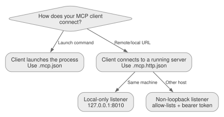

# MCP client recipes

This page assumes the low-token router profile from
[getting-started.md](getting-started.md):

```env
HPE_MCP_ROUTER_MODE=minimal
HPE_MCP_TOOLSETS=central,glp,rag
```

This exposes only `find_tool`, `invoke_read_tool`, and `invoke_tool` in
minimal mode while still letting the router reach the backend catalog on
demand. The complete index can contain 6,715 backend tools, while minimal
mode keeps only three discovery/dispatch tools in client context.

By the end of this page you will have picked the right transport for your
client, copied an accurate config for it, started the router if needed, and
run one MCP call to confirm the connection works.

## Choose a transport: stdio vs streamable HTTP

<figure class="docs-figure">
  
  <figcaption>If your client launches the MCP server process itself, use
  stdio and <code>.mcp.json</code>. If your client connects to a server
  that is already running, use streamable HTTP and
  <code>.mcp.http.json</code> — pointed at a loopback listener on the same
  machine, or at a non-loopback listener that is protected with host/origin
  allow-lists and a bearer token.</figcaption>
</figure>

<div class="docs-compact-table" markdown="1">

| Style | Use when | Config |
|---|---|---|
| stdio | Your client launches the MCP server process | `.mcp.json.example`, `.cursor/mcp.json`, `.vscode/mcp.json.example`, `.claude/launch.json` |
| streamable HTTP | Your client connects to an already-running local MCP server | `.mcp.http.json.example` + `scripts/run_http_router.sh` |

</div>

## Profile matrix

The root-level committed configs above are all the **minimal** router
profile (`HPE_MCP_ROUTER_MODE=minimal`, `HPE_MCP_TOOLSETS=central,glp,rag`,
`HPE_MCP_ACCESS_PROFILE=custom`, no optional products) -- the recommended
default for every client. For the **full safe-read-only** profile, the
separate **full read/write** profile, a
non-loopback **bearer-protected HTTP** profile, and a Copilot CLI/app
example, see the tested configs and full client/transport/profile matrix in
[`examples/README.md`](../examples/README.md). `cwd`/`PYTHONPATH`/
`CREDS_PATH` behavior and the package-installed (`hpe-mcp-router`)
alternative to the direct script path are also documented there.

<div class="docs-callout docs-callout--info" markdown="1">

Any MCP-capable AI client/model can connect over streamable HTTP if the
client supports remote MCP servers — this is not limited to the clients
listed below.

</div>

## Copy/paste client configs

<div class="audience-grid">
  <div class="audience-card" markdown="1">

### Generic stdio client

Run the wizard:

```bash
python3 scripts/setup_wizard.py --yes --skip-credentials
```

Or copy the generic file manually:

```bash
cp .mcp.json.example .mcp.json
```

Edit `.mcp.json` and replace `/path/to/hpe-networking-mcp` with your local clone
path:

```json
{
  "mcpServers": {
    "hpe-networking-mcp": {
      "command": "/path/to/hpe-networking-mcp/.venv/bin/python3",
      "args": ["/path/to/hpe-networking-mcp/src/hpe_networking_mcp/mcp_servers/tool_router.py"],
      "cwd": "/path/to/hpe-networking-mcp",
      "env": {
        "PYTHONPATH": "/path/to/hpe-networking-mcp/src",
        "CREDS_PATH": "/path/to/hpe-networking-mcp/config/credentials.yaml",
        "HPE_MCP_ROUTER_MODE": "minimal",
        "HPE_MCP_TOOLSETS": "central,glp,rag"
      }
    }
  }
}
```

  </div>
  <div class="audience-card" markdown="1">

### Cursor

The committed `.cursor/mcp.json` is already the default low-token router
profile — no copy step needed:

```json
{
  "mcpServers": {
    "hpe-networking-mcp": {
      "command": "${workspaceFolder}/.venv/bin/python3",
      "args": ["${workspaceFolder}/src/hpe_networking_mcp/mcp_servers/tool_router.py"],
      "cwd": "${workspaceFolder}",
      "env": {
        "PYTHONPATH": "${workspaceFolder}/src",
        "CREDS_PATH": "${workspaceFolder}/config/credentials.yaml",
        "HPE_MCP_ROUTER_MODE": "minimal",
        "HPE_MCP_TOOLSETS": "central,glp,rag"
      }
    }
  }
}
```

Use `.cursor/mcp.dev.json` only when debugging direct backend servers — it
registers the six core Aruba servers (`central-monitoring`, `central-config`,
`central-ops`, `central-nac`, `glp-core`, `rag-core`) plus
`central-generated` directly, so it costs more tool-list context than
the router profile. Copy it over `mcp.json` only while debugging one tool.

  </div>
  <div class="audience-card" markdown="1">

### VS Code

```bash
cp .vscode/mcp.json.example .vscode/mcp.json
```

Keep the `hpe-networking-mcp` server entry enabled for normal use:

```json
{
  "servers": {
    "hpe-networking-mcp": {
      "type": "stdio",
      "command": "${workspaceFolder}/.venv/bin/python3",
      "args": ["${workspaceFolder}/src/hpe_networking_mcp/mcp_servers/tool_router.py"],
      "env": {
        "PYTHONPATH": "${workspaceFolder}/src",
        "CREDS_PATH": "${workspaceFolder}/config/credentials.yaml",
        "HPE_MCP_ROUTER_MODE": "minimal",
        "HPE_MCP_TOOLSETS": "central,glp,rag"
      }
    }
  }
}
```

  </div>
  <div class="audience-card" markdown="1">

### Included `.claude` launch profiles

Use `.claude/launch.json` as-is — no copy step needed. The first profile is
the same minimal router setup:

```json
{
  "name": "hpe-networking-mcp MCP server (minimal)",
  "runtimeExecutable": "python",
  "runtimeArgs": ["-m", "hpe_networking_mcp.mcp_servers.tool_router"],
  "env": {
    "HPE_MCP_ROUTER_MODE": "minimal",
    "HPE_MCP_TOOLSETS": "central,glp,rag"
  }
}
```

The remaining profiles in that file are direct debug servers
(`central-monitoring`, `central-config`, `central-ops`, `central-nac`, `glp-core`)
plus two CLI launch entries for the migration pipeline and SSID builder —
use those only when debugging a specific backend or script outside the
router.

  </div>
</div>

<div class="docs-checkpoint">
  <span class="docs-checkpoint__number">1</span>
  <div class="docs-checkpoint__body" markdown="1">

**Checkpoint:** whichever config you copied, confirm the local doctor sees it
before opening your client:

```bash
uv run hpe-mcp-doctor
```

Look for `[OK] Local stdio MCP config: .mcp.json exists` (or the matching
HTTP line below) in the output.

  </div>
</div>

## Streamable HTTP

Start the local HTTP router. The helper defaults to port `8010`, matching
`.mcp.http.json.example`:

```bash
python3 scripts/setup_wizard.py --yes --skip-credentials
MCP_PORT=8010 bash scripts/run_http_router.sh
```

Copy the generic HTTP client snippet:

```bash
cp .mcp.http.json.example .mcp.http.json
```

```json
{
  "mcpServers": {
    "hpe-networking-mcp-http": {
      "url": "http://127.0.0.1:8010/mcp",
      "transport": "streamable-http"
    }
  }
}
```

Point your MCP client to:

```text
http://127.0.0.1:8010/mcp
```

If you change `MCP_HOST` or `MCP_PORT`, update `.mcp.http.json` to match. The
HTTP helper safely loads expected local `.env` assignments first, so optional
products selected in the wizard are available to the router process. Its
startup banner prints `HPE_MCP_ACCESS_PROFILE`, selected products, and
`HPE_MCP_PRODUCT_ACCESS` so write visibility is obvious before connecting a
client. If the
port is already in use, `scripts/run_http_router.sh` exits before starting
another router and prints the listener details:

```bash
lsof -nP -iTCP:8010 -sTCP:LISTEN
kill <PID>
```

<div class="docs-callout docs-callout--danger" markdown="1">

For non-loopback HTTP, configure explicit host and origin allow-lists — the
server refuses to start on a non-loopback bind without both:

```env
MCP_ALLOWED_HOSTS=mcp.example.test
MCP_ALLOWED_ORIGINS=https://client.example.test
MCP_HTTP_BEARER_TOKEN=replace-with-a-long-random-value
```

The client must send `Authorization: Bearer <token>`. Static bearer
protection is supported only with `streamable-http`; configuring it with SSE
refuses startup.

</div>

## Optional product clients

Keep optional products disabled unless you want them in the current MCP session.
The wizard can enable only the starters you choose, write the matching local
`.env`, and add the product selector to local stdio MCP configs:

```bash
python3 scripts/setup_wizard.py --products clearpass,mist
```

Use `--with-products` only when you want every starter backend enabled. Add
`--access-profile full-read-write` only for trusted sessions that need all
loaded write tools visible. Use `--access-profile custom --product-access
read-write` for the legacy mixed-gate behavior.

## Verify local setup

Run the local doctor before opening the client:

```bash
uv run hpe-mcp-doctor
```

It does not call Central, GLP, or optional product APIs. It checks copied
local configs, placeholder paths, HTTP URL/transport mismatch, low-token
router profile drift, optional product env, local indexes, RAG
source-manifest drift, and listener status.

## First useful MCP call flow

```text
find_tool("show critical alerts")
invoke_read_tool("list_active_alerts", {"severity": "CRITICAL", "limit": 20})
```

<div class="docs-checkpoint">
  <span class="docs-checkpoint__number">2</span>
  <div class="docs-checkpoint__body" markdown="1">

**Expected result:** a bounded, paginated response — for example, on a
fresh/quiet tenant (fake sample data):

```json
{
  "items": [],
  "_pagination": {"offset": 0, "limit": 20, "total": 0, "truncated": false}
}
```

An empty `items` list with valid `_pagination` still confirms the client,
router, and credentials are wired together correctly — it just means there
are no matching alerts right now.

  </div>
</div>

<span class="docs-badge docs-badge--read">read</span> Use `invoke_read_tool`
for investigations.
<span class="docs-badge docs-badge--destructive">destructive</span> Use
`invoke_tool` only after intentional write/destructive user intent.

<div class="docs-next" markdown="1">

## Next steps

- [example-prompts.md](example-prompts.md) — more copy/paste
  `find_tool` / `invoke_read_tool` flows.
- [getting-started.md](getting-started.md) — install, credentials, catalog,
  and validation steps that come before this page.
- [troubleshooting.md](troubleshooting.md) — fixes for connection, auth, and
  transport problems.
- [tool-router.md](tool-router.md) — router modes, safety gates, and
  observability in depth.

</div>
