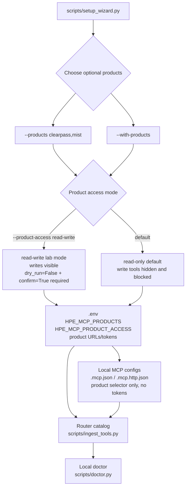

# Optional product starters

hpe-networking-mcp keeps optional products disabled by default so normal MCP sessions
stay low-token. Enable only the starters you want for the current setup.

```bash
python3 scripts/setup_wizard.py --products clearpass,mist
```

Use every starter only when you intentionally want the broader catalog:

```bash
python3 scripts/setup_wizard.py --with-products
```

<figure class="docs-figure" markdown="1">



<figcaption>Match the goal to a backend, then jump to its card below for the
required environment variables and a safe first call.</figcaption>
</figure>

## Read-only vs. write-safety, at a glance

<div class="docs-callout docs-callout--safe" markdown="1">
**Read-only and diagnostic tools are always discoverable.** Once a backend is
enabled, call read-only tools through `invoke_read_tool`; call diagnostics
through `invoke_tool`. Neither category needs optional-product write access.
</div>

<div class="docs-callout docs-callout--danger" markdown="1">
**Write and destructive tools are opt-in twice over.** `HPE_MCP_PRODUCT_ACCESS`
defaults to `read-only`, which hides every optional-product write tool from
`find_tool` and blocks direct execution through `invoke_tool`. Even after
access is opened, each write tool still defaults to `dry_run=True` and
requires an explicit `dry_run=False` **and** `confirm=True` on the same call
before it touches a real vendor API.
</div>

<div class="docs-compact-table" markdown="1">

| | Read-only / diagnostic tools | Write / destructive tools |
|---|---|---|
| Discovery | Always listed by `find_tool` | Hidden under `safe-read-only`, or under `custom` while `HPE_MCP_PRODUCT_ACCESS=read-only` |
| Dispatch | Reads use `invoke_read_tool`; diagnostics use `invoke_tool` | `invoke_tool` returns a `blocked` error until access is opened |
| To open | Nothing to do | `HPE_MCP_ACCESS_PROFILE=full-read-write`, or `custom` with `HPE_MCP_PRODUCT_ACCESS=read-write` / one `HPE_MCP_<PLATFORM>_WRITES=1` |
| Per-call guardrail | Server-side pagination/byte bounds | Also requires `dry_run=False` **and** `confirm=True` in the same call |
| Blast radius | Bounded reads or non-mutating diagnostics | Real vendor mutation once both gates above are satisfied |

</div>

A platform-specific override (`HPE_MCP_MIST_WRITES=1`,
`HPE_MCP_UXI_WRITES=1`, `HPE_MCP_AXIS_WRITES=1`, `HPE_MCP_APSTRA_WRITES=1`,
`HPE_MCP_CLEARPASS_WRITES=1`, `HPE_MCP_AOS8_WRITES=1`,
`HPE_MCP_EDGECONNECT_WRITES=1`) takes precedence over
`HPE_MCP_PRODUCT_ACCESS` only under the `custom` profile, so you can open one
lab backend for writes without exposing every optional product. Under
`safe-read-only` or `full-read-write`, legacy gates must align with the
aggregate profile. Invalid or contradictory values refuse startup.

## Try one safely

Each card shows the environment variables that turn a backend on, how to
enable it for the router/catalog, and one real read-only call you can run
immediately after setup — no write flags involved.

<div class="example-grid" markdown="1">

<div class="example-card" markdown="1">

### <span class="docs-badge">ClearPass</span> <span class="docs-badge">Access control / NAC</span>

- **Env:** `CLEARPASS_BASE_URL`, `CLEARPASS_API_TOKEN`
- **Enable:** `HPE_MCP_PRODUCTS=clearpass`
- **Write gate:** `HPE_MCP_CLEARPASS_WRITES`

```text
invoke_read_tool("clearpass_list_endpoints", {"limit": 5, "status": "Known"})
```

</div>

<div class="example-card" markdown="1">

### <span class="docs-badge">Juniper Mist</span> <span class="docs-badge">Wireless / WAN assurance</span>

- **Env:** `MIST_HOST`, `MIST_API_TOKEN` (optional session cookie/CSRF)
- **Enable:** `HPE_MCP_PRODUCTS=mist`
- **Write gate:** `HPE_MCP_MIST_WRITES`

```text
invoke_read_tool("mist_list_sites", {"org_id": "11111111-2222-3333-4444-555555555555", "limit": 5})
```

</div>

<div class="example-card" markdown="1">

### <span class="docs-badge">Apstra</span> <span class="docs-badge">Data-center fabric</span>

- **Env:** `APSTRA_BASE_URL`, `APSTRA_USERNAME`/`APSTRA_PASSWORD` (or `APSTRA_API_TOKEN`)
- **Enable:** `HPE_MCP_PRODUCTS=apstra`
- **Write gate:** `HPE_MCP_APSTRA_WRITES`

```text
invoke_read_tool("apstra_list_blueprints", {"limit": 5})
```

Some Apstra query endpoints use `POST` without changing state. They remain
read-only tools and accept their required JSON query payload through `body`,
without `dry_run` or `confirm`:

```text
invoke_read_tool("apstra_search_connectivity_templates", {
  "blueprint_id": "blueprint-id",
  "body": {"<query-field>": "<value>"}
})
```

The exact query object is version-specific; use the fields documented by the
Apstra API running in your environment.

</div>

<div class="example-card" markdown="1">

### <span class="docs-badge">ArubaOS 8</span> <span class="docs-badge">Controller migration</span>

- **Env:** `AOS8_BASE_URL`, `AOS8_USERNAME`/`AOS8_PASSWORD` (or legacy `AOS8_API_TOKEN`)
- **Enable:** `HPE_MCP_PRODUCTS=aos8`
- **Write gate:** `HPE_MCP_AOS8_WRITES`

```text
invoke_read_tool("aos8_list_aps", {"config_path": "/md", "limit": 5})
```

</div>

<div class="example-card" markdown="1">

### <span class="docs-badge">EdgeConnect</span> <span class="docs-badge">SD-WAN operations</span>

- **Env:** `EDGECONNECT_BASE_URL`, `EDGECONNECT_API_TOKEN` (optional `EDGECONNECT_AUTH_HEADER`)
- **Enable:** `HPE_MCP_PRODUCTS=edgeconnect`
- **Write gate:** `HPE_MCP_EDGECONNECT_WRITES`

```text
invoke_read_tool("edgeconnect_list_appliances", {"limit": 5})
```

</div>

<div class="example-card" markdown="1">

### <span class="docs-badge">HPE Aruba UXI</span> <span class="docs-badge">Synthetic experience</span>

- **Env:** `UXI_CLIENT_ID`, `UXI_CLIENT_SECRET` (optional `UXI_BASE_URL`, `UXI_TOKEN_URL`)
- **Enable:** `HPE_MCP_PRODUCTS=uxi`
- **Write gate:** `HPE_MCP_UXI_WRITES`

```text
invoke_read_tool("uxi_list_sensors", {"page_size": 5})
```

</div>

<div class="example-card" markdown="1">

### <span class="docs-badge">Axis Atmos Cloud</span> <span class="docs-badge">Cloud access policy</span>

- **Env:** `AXIS_BASE_URL`, `AXIS_API_TOKEN`
- **Enable:** `HPE_MCP_PRODUCTS=axis`
- **Write gate:** `HPE_MCP_AXIS_WRITES`

```text
invoke_read_tool("axis_get_applications", {"page_size": 5})
```

</div>

<div class="example-card" markdown="1">

### <span class="docs-badge">Design</span> <span class="docs-badge">Diagrams / topology</span>

- **Env:** none required (optional `HPE_MCP_DIAGRAM_ICON_DIR` for local vendor icon packs)
- **Enable:** `HPE_MCP_PRODUCTS=design`
- **Write gate:** n/a (local generation only; tools are read-only)

```text
invoke_read_tool("drawio_network_design_diagram", {
  "model": {
    "title": "Branch A",
    "nodes": [
      {"id": "core", "label": "Core-SW", "role": "core_switch", "vendor": "aruba"},
      {"id": "ap1", "label": "AP-1", "role": "campus_ap", "vendor": "aruba"}
    ],
    "links": [{"source": "core", "target": "ap1", "link_type": "ethernet"}]
  },
  "save": true
})
```

Outputs editable `.drawio` under `outputs/diagrams/`. Also:
`export_graphviz_topology` (Graphviz), `export_next_ui_topology` (NeXt JSON).
Vendor logos are not shipped — see `resources/diagram_icons/README.md`
(Juniper image library link for Mist packs you host locally).

</div>


</div>

`HPE_MCP_PRODUCTS` (comma-separated) is what the setup wizard and
`scripts/ingest_tools.py --products ...` use to build the catalog.
`HPE_MCP_TOOLSETS` (comma-separated, e.g. `HPE_MCP_TOOLSETS=central,glp,rag`)
additionally narrows which backends the running router loads — include a
platform name there too (e.g. `mist`) if you want the router itself scoped
to just that optional backend.

## Wizard product labels

| Product | Variables |
|---|---|
| Network design diagrams (Draw.io / Graphviz / NeXt) | none required; optional `HPE_MCP_DIAGRAM_ICON_DIR` |

## Product matrix

<div class="docs-compact-table" markdown="1">

| Product | Read-only annotated / total | Enables | Required settings | Safety surface |
|---|---:|---|---|---|
| ClearPass | 285 / 845 | CPPM 6.12.7 APIs plus verified Insight endpoint and OnGuard activity workflows, and (v0.7) typed Access Tracker session search/disconnect, endpoint list, guest list/create, role and enforcement-policy reads, service list/get/enable-disable, syslog target/export-filter reads, and server-version/cluster-server diagnostics | `CLEARPASS_BASE_URL`, `CLEARPASS_API_TOKEN` | `/oauth` is excluded; writes dry-run by default |
| Juniper Mist | 547 / 1,080 | Official 1,050-operation OpenAPI plus NAC, Marvis, inventory, Wired and WAN Assurance, bounded authenticated regional WebSocket diagnostic-result collection, and (v0.7) typed org/site SLE assurance summary reads | `MIST_HOST`, `MIST_API_TOKEN`; optional session cookie/CSRF | Writes dry-run by default; diagnostics are distinct from config writes |
| Apstra | 86 / 155 | Official 6.1 SDK-derived blueprints, tasks, endpoint policies, object policies, topology, and protocols, plus (v0.7) top-level resource pools (IP/IPv6/VLAN/ASN/VNI/integer/device), device/rack profiles, system agents, telemetry, and blueprint-scoped IBA | `APSTRA_BASE_URL`, preferred `APSTRA_USERNAME`/`APSTRA_PASSWORD`, optional `APSTRA_API_TOKEN` | Current `/api/aaa/login` with older `/api/user/login` fallback |
| ArubaOS 8 | 132 / 311 | UIDARUBA/X-CSRF/SESSION auth, 258 generated config operations, exhaustive exports, and resumable Classic/New Central migration runs | `AOS8_BASE_URL`, preferred `AOS8_USERNAME`/`AOS8_PASSWORD`, optional legacy `AOS8_API_TOKEN`, optional `AOS8_CLIENT_IP`, optional `AOS8_SESSION_TTL_SECONDS` | Writes dry-run by default and require write-memory to persist |
| EdgeConnect | 687 / 1,270 | 1,216 generated operations, multipart uploads, fail-closed Swagger compatibility diagnostics, curated SD-WAN workflows, and (v0.7) confirmed alarm acknowledge/clear/summary and flow list/stats workflows | `EDGECONNECT_BASE_URL`, `EDGECONNECT_API_TOKEN`, optional `EDGECONNECT_AUTH_HEADER` and session overrides | Source artifact is reproducible but must be checked against live Orchestrator Swagger |
| HPE Aruba UXI | 24 / 49 | Current 25-operation API plus OAuth, sensor/agent/group/network/test inventories and documented writes | `UXI_CLIENT_ID`, `UXI_CLIENT_SECRET`, optional `UXI_BASE_URL`, optional `UXI_TOKEN_URL` | Generic writes accept only documented method/path pairs; 5 requests/second |
| Axis Atmos Cloud | 12 / 47 | Reviewed application, connector, tunnel, location, policy, status, and commit workflows from the deterministic SHA-pinned manifest generator, plus (v0.7) a read-only split-CRUD contract verification harness and a gated, plan-only disposable-write harness | `AXIS_BASE_URL`, `AXIS_API_TOKEN` | Writes dry-run by default |
| Design (diagrams) | 7 / 7 | Local Draw.io, Graphviz, and NeXt UI topology exporters fed by a structured model or Central `get_topology` payloads | optional `HPE_MCP_DIAGRAM_ICON_DIR` | No vendor API; artifacts under `outputs/diagrams/` |
| **Optional subtotal** | **1,773 / 3,757** | Seven opt-in product backends | Product-specific | Hidden and blocked unless enabled |

</div>

Combined with the Central/GLP/RAG surfaces, the platform API backend catalog
contains 3,153 read-only-annotated tools and 6,704 registered tools --
matching [`docs/capability-gap-matrix.md`](capability-gap-matrix.md)'s Total
row, and excluding the two credential-free local backends (`design-core`,
`interop-core`) that add up to the complete 6,716-tool registered catalog
reported in [`docs/tool-catalog.md`](tool-catalog.md). Diagnostic tools are
available in optional read-only mode but are not included in the read-only
annotation count.

The generic GET tools reject absolute URLs and stay bounded to the configured
product host. List-like responses are paged with `limit` and `offset` when
possible so broad API calls do not flood the MCP context.

For ArubaOS 8 typed configuration-object writes, the manage tools return
`requires_write_memory_for` with each affected `config_path`. Run
`aos8_write_memory` for those hierarchy nodes only after reviewing the pending
changes and confirming the staged config should be persisted.

Use `aos8_export_all` and `aos8_migration_plan` before migration work. Export
now exhausts local pages and includes WLANs, roles, VLANs, AP groups,
controllers, policies, AAA profiles/servers, IPv4/IPv6 routes, and VRRP. The plan
normalizes the supported migration objects into
separate Classic Central and New Central candidates, reports lossy mappings,
produces deterministic diffs, and returns read-only post-migration checks.

For resumable execution, use `aos8_preview_migration_run`, then
`aos8_create_migration_run`. Run `aos8_apply_migration_run` with its default
`dry_run=True` before calling it with `dry_run=False`, `confirm=True`, and any
required target secrets. Secrets are accepted only for that attempt and are
never written to `state/aos8_migrations/`. Use `aos8_get_migration_run`,
`aos8_list_migration_runs`, and `aos8_verify_migration_run` for bounded status
and read-only source-intent/target-result comparisons. New Central guidance is
limited to post-change checkpoint policy plus automatic device rollback; there
is no manual checkpoint listing or restore workflow. Classic Central guidance
remains export-before-apply. Override the state directory only when needed with
`HPE_MCP_AOS8_MIGRATION_STATE_DIR`.

### ArubaOS 8 migration prerequisites

Migration-verified mappings are gated by the authoritative
[AOS8 migration contract matrix](aos8-migration-contract-matrix.md); a
read-only [live/dry-run evaluation](aos8-live-dryrun-evaluation.md) records
exactly what was and was not exercised live in one prior evaluation
environment. The in-progress
[0.6 live-lab evaluation](aos8-live-lab-evaluation-0.6.md) records evidence
from the stricter multi-surface harness below. To reproduce or extend that evaluation against your own
ArubaOS 8 estate:

| Requirement | Variable(s) | Notes |
|---|---|---|
| AOS8 source access | `AOS8_BASE_URL`, `AOS8_USERNAME`/`AOS8_PASSWORD` (or legacy `AOS8_API_TOKEN`) | Required for any live export, login, or Classic/New Central migration plan against a real Mobility Conductor/controller |
| Login client context (optional) | `AOS8_CLIENT_IP` | Optional `client_ip` query parameter sent at login; leave unset unless your controller requires it |
| Session lifetime (optional) | `AOS8_SESSION_TTL_SECONDS` | Cached session lifetime in seconds; default 600, max 3600 |
| New Central target access | `central_account` in `config/credentials.yaml` | Required for any live New Central preflight read or preview/apply against a real tenant |
| Classic Central target access | An explicit Classic group name, GUID, or device serial | Required before any live Classic Central preview or apply; **never inferred from a New Central scope** even when one is configured |

Without AOS8 credentials configured, AOS8 source parsing and Classic Central
target behavior can still be exercised against the fixture-backed unit test
suite (`tests/unit/test_aos8_parsers.py`, `test_aos8_migration.py`,
`test_aos8_session.py`, `test_aos8_target_adapters.py`), but not against a
live controller. New Central preflight reads and stateless `preview()` calls
can be exercised live with only `central_account` configured, independent of
AOS8 access.

### AOS8 0.6 live-lab evidence harness

`scripts/evaluate_aos8_060_lab.py` extends the 0.5 read-only evaluator with
independent AOS8, Classic Central, and New Central evidence modes plus a
strictly gated controlled-write workflow. Read-only Central mode may perform
the OAuth token POST needed to authenticate, then installs a data-plane guard
that permits only `GET`/`HEAD`/`OPTIONS`. AOS8 mode permits session login and
logout but blocks any non-GET export request.

```bash
# Fully offline, fixture-backed baseline
uv run python scripts/evaluate_aos8_060_lab.py --offline

# Bounded live AOS8 export evidence; output contains counts and a sanitized
# digest, not raw configuration values
uv run python scripts/evaluate_aos8_060_lab.py \
  --live-aos8-readonly \
  --config-path /md \
  --limit 100 \
  --max-items-per-type 1000

# Explicit Classic or New Central target; candidate JSON contains a list or
# {"candidates": [...]} and no real secrets
uv run python scripts/evaluate_aos8_060_lab.py \
  --live-central-readonly \
  --target-type new_central \
  --scope-name "Disposable Lab" \
  --persona CAMPUS_AP \
  --candidates inputs/aos8-lab-candidates.json
```

Controlled writes are a mandatory two-phase process. Candidate identifiers
must start with `hpe-mcp-lab-`; numeric VLANs require an explicit
`--lab-vlan-id`. Plan generation performs live preflight reads and refuses
existing targets, blocked/dry-run-only mappings, or candidates without a
verified cleanup operation.

```bash
uv run python scripts/evaluate_aos8_060_lab.py \
  --prepare-write-plan \
  --target-type new_central \
  --scope-name "Disposable Lab" \
  --persona CAMPUS_AP \
  --candidates inputs/aos8-lab-candidates.json \
  --output outputs/aos8-lab-plan.json

export HPE_MCP_CENTRAL_WRITES=1
uv run python scripts/evaluate_aos8_060_lab.py \
  --execute-write-plan outputs/aos8-lab-plan.json \
  --confirm-digest "<preview_sha256 from the reviewed plan>" \
  --confirm-target "Disposable Lab" \
  --allow-lab-writes \
  --cleanup-after-write \
  --secret-inputs inputs/aos8-lab-secrets.json
```

The secret-input file must be readable only by its owner (`chmod 600`) and is
never copied into the plan or output. Execution recomputes the live preview
and refuses to continue if its digest changed after review. Cleanup is
mandatory, runs in reverse candidate order, refuses candidates without a
verified delete path, and verifies target absence. This is disposable-lab
cleanup, not general migration rollback.

Future per-platform live-evaluation harnesses should reuse the shared,
credential-gated live-test configuration in `src/hpe_networking_mcp/pipeline/live_test_config.py`
(`HPE_MCP_LIVE_TEST_<PLATFORM>_READ`/`_WRITE`, default disabled, never
inferred from credential presence) and write any evidence file through
`src/hpe_networking_mcp/pipeline/artifact_contracts.py`'s versioned, bounded, redacted
`live_lifecycle_evidence` contract instead of hand-rolling another ad hoc
JSON shape -- see
[Artifact contracts and live-test configuration](artifact-contracts.md).

EdgeConnect API generations differ materially. Run
`edgeconnect_doctor` against the target Orchestrator before using operational
tools. The pinned artifact is named for 9.7 but declares API version 7.2.0
internally, so production compatibility must be confirmed against that
Orchestrator's instance-hosted Swagger specification.

Export the target Orchestrator's Swagger/OpenAPI document to a local file, then
run the fail-closed compatibility check:

```bash
uv run python scripts/generate_edgeconnect_tools.py \
  --source inputs/target-orchestrator-openapi.json \
  --expect-sha256 <sha256> \
  --report-output outputs/edgeconnect-compatibility.json
```

JSON and YAML Swagger 2.0, OpenAPI 3.0, and OpenAPI 3.1 documents are accepted.
The report compares operations, methods, paths, auth declarations, API version,
base-path assumptions, and source/manifest digests with the committed
1,216-operation baseline. Malformed input, unsupported versions, stale
baselines, digest mismatch, endpoint drift, unsupported auth, and non-root
server base paths all fail closed. The local document and credentials are never
uploaded; authenticated download is intentionally left to approved local
operator tooling.

The command is read-only unless `--generate` is explicitly supplied. Even then,
it replaces the generated manifest only after validation succeeds and updates
`src/hpe_networking_mcp/mcp_servers/openapi_gen/provenance/edgeconnect.json`.

The 25-operation Axis manifest is a reviewed derivation from the MIT-licensed
upstream registry, not a redistributed proprietary specification. Verify the
committed pin offline with
`uv run python scripts/generate_axis_manifest.py --check`. Regenerate from a
pinned local checkout with `--source-dir PATH`, or use the explicit
digest-validated network path with `--fetch`.

### v0.7 optional-product depth (`v07-optional-depth`)

Each optional backend gained authoritative-source-grounded depth without
inventing an endpoint anywhere:

- **Apstra**: the reviewed `aos-sdk-api` 6.1.2.post1 wheel was re-inspected
  (its `RestResources`/`RestResource` class definitions in
  `aos/sdk/api/_client.py`) to confirm and add top-level resource pools
  (IP/IPv6/VLAN/ASN/VNI/integer/device), device/rack profiles
  (device/linecard/chassis profiles, device-profile digests+clone,
  rack-types), system agents (agents, manager-config, jobs,
  profiles+assign), telemetry (service registry, collectors), and
  blueprint-scoped IBA (dashboards, anomalous-stages, probes,
  predefined-probes) — see `scripts/_apstra_operations.py`. Where the pinned
  SDK does not expose a schema for a verb (device-profile digests are
  read-only; rack-type creation and telemetry-collector deletion have no
  pinned schema; IBA widgets/import/export and the binary
  streaming-telemetry-schema endpoint are out of scope), the manifest
  provenance records an explicit, source-cited coverage gap instead of
  guessing — see the `coverage_gaps` list in
  `src/hpe_networking_mcp/mcp_servers/openapi_gen/provenance/apstra.json`.
- **ClearPass**: added typed Access Tracker (session search/get/disconnect),
  endpoint list, guest list/create, policy (roles, enforcement policies),
  service (list/get/enable-disable), syslog (targets, export filters), and
  diagnostic (server version, cluster servers) workflows, all wrapping
  paths already present in the committed 816-operation manifest.
- **EdgeConnect**: added confirmed alarm acknowledge/clear/summary and flow
  list/stats curated workflows on top of the existing fail-closed Swagger
  compatibility checker (`scripts/generate_edgeconnect_tools.py`,
  `src/hpe_networking_mcp/mcp_servers/openapi_gen/compatibility.py`).
- **Mist**: added typed org/site SLE assurance summary reads
  (`mist_get_org_sle_overview`, `mist_get_site_sle_metric_summary`)
  alongside the existing `mist_get_site_assurance_snapshot` composite and
  alarm/event tools.
- **Axis**: added `scripts/evaluate_axis_lab.py`, a three-layer harness —
  (1) an always-on, offline, no-network static check that every one of the
  11 Axis entity families, including nested sub-locations, exposes a complete
  split query/create/update/delete
  contract; (2) a bounded, opt-in, read-only live check
  (`HPE_MCP_LIVE_TEST_AXIS_READ=1`) that calls up to five list queries
  once; (3) a disposable-write **plan** (opt-in via
  `HPE_MCP_LIVE_TEST_AXIS_WRITE=1`, which requires the read gate too) that
  is only ever generated and hashed, never executed — no create/delete call
  is ever made with `dry_run=False` by this harness.
- **UXI**: confirmed the committed 25-operation manifest is already fully
  exposed (curated + generated tools); the one permanent upstream omission
  (service tests have no create/update/delete API, only list, and only their
  group *assignment* is writable) is recorded rather than worked around.

Every backend also gets one bounded, redacted evidence artifact via
`scripts/build_optional_product_evidence.py`
(`src/hpe_networking_mcp/pipeline/optional_product_evidence.py`), which compares each committed
manifest against its own git history baseline (adding zero network
dependency) and republishes each manifest's own documented coverage gaps.
Add `--platform <name>` to build one backend at a time; omit it to build all
six. A platform's live-evidence artifact is only added when that platform's
`HPE_MCP_LIVE_TEST_<PLATFORM>_READ=1` gate is set and its credentials are
configured (see [Artifact contracts and live-test configuration](artifact-contracts.md));
neither is ever enabled automatically. All artifacts land in
`outputs/optional-product-evidence/` (git-ignored, regenerable).

Generated EdgeConnect multipart upload tools accept file fields as
`{"filename": "...", "content_base64": "...", "content_type": "..."}` and
enforce a 20 MiB decoded-file limit.

Product base URLs must use HTTPS and public hostnames by default. For local lab
testing against localhost or private IPs, set
`HPE_MCP_ALLOW_LOCAL_PRODUCT_URLS=1` only in that trusted lab environment.
Remove that opt-in again before normal operation; leaving it unset keeps the
private/loopback URL guard enabled. The launcher and local doctor warn about
retired `CENTRALMCP_*` environment names because those values are ignored.

## What the wizard writes

When you select products, the setup wizard:



1. Adds or merges `HPE_MCP_PRODUCTS`, `HPE_MCP_PRODUCT_ACCESS`, and
   product URL/token settings into local `.env`; existing non-placeholder token
   values are preserved unless you pass `--force`.
2. Adds only `HPE_MCP_PRODUCTS` and `HPE_MCP_PRODUCT_ACCESS` to local MCP
   config files, leaving product tokens in `.env`.
3. Builds the router tool catalog with the selected product starters (or every
   starter with `--with-products`) and access mode; product tokens are not
   passed to the catalog-build subprocess.
4. Lets `scripts/doctor.py` confirm required product variables are present.

Real `.env`, `.mcp.json`, and `.vscode/mcp.json` files are git-ignored.

## Manual setup

The wizard defaults optional products to read-only and records the access mode
in local `.env` / MCP config files. Use explicit read/write lab mode when you
want write tools visible and still guarded by `dry_run=False` plus
`confirm=True`:

```bash
python3 scripts/setup_wizard.py --products clearpass,mist --access-profile full-read-write
```

Use `--access-profile safe-read-only` for a globally read-only generated
profile, or `--access-profile custom --product-access read-write` for the
legacy optional-product-only write mode.

For manual shell setup:

```bash
export HPE_MCP_PRODUCTS=clearpass,mist
export HPE_MCP_ACCESS_PROFILE=custom
export HPE_MCP_PRODUCT_ACCESS=read-only
export CLEARPASS_BASE_URL=https://clearpass.example.com
export CLEARPASS_API_TOKEN=...
export MIST_HOST=https://api.mist.com
export MIST_API_TOKEN=...
uv run python scripts/ingest_tools.py --products clearpass,mist
```

For every loaded lab write tool, rerun
`python3 scripts/setup_wizard.py --products clearpass,mist --access-profile full-read-write`;
the wizard aligns the aggregate profile and every legacy gate together. Do not
change only `HPE_MCP_ACCESS_PROFILE` in a shell that still exports custom or
safe-profile gates. Use `custom` plus `HPE_MCP_PRODUCT_ACCESS=read-write` for
the legacy optional-product-only mode.

For streamable HTTP, `scripts/run_http_router.sh` safely loads expected local
`.env` assignments before starting the router, including the product selector,
access mode, supported product URL/token variables, and UXI OAuth settings:

```bash
MCP_PORT=8010 bash scripts/run_http_router.sh
```

## When to add product-specific tools

Keep expanding typed product tools when a workflow is common enough to deserve
a named function instead of a generic GET call, for example:

| Workflow type | Better as a typed tool? |
|---|---|
| "Show ClearPass endpoint status for this MAC" | Yes |
| "List Mist sites with client counts" | Yes |
| "Fetch this one documented endpoint while exploring" | Generic GET is fine |
| "Perform a write/remediation action" | Yes, with explicit destructive annotations and confirmation |

See [Typed product workflow roadmap](product-workflows.md) for implemented
ClearPass, Mist, Apstra, ArubaOS 8, EdgeConnect, and UXI workflows plus
candidates.
