# Troubleshooting

Start with the local doctor. It never calls Central, GLP, or optional product
APIs, so it is always safe to run first and re-run after every fix.

```bash
uv run hpe-mcp-doctor
```

<div class="docs-callout docs-callout--safe" markdown="1">
`doctor.py` only reads local files and environment variables. If a symptom
below could be caused by local setup, config, or credentials, run the
doctor before anything else — its `[OK]` / `[WARN]` / `[FAIL]` lines usually
point straight at the next step.
</div>

<figure class="docs-figure" markdown="1">



<figcaption>Follow the tree top to bottom: local setup, then auth, then
transport, then the tool catalog, then RAG/index freshness. Jump straight to
the matching section below.</figcaption>
</figure>

- [Setup and doctor](#setup-and-doctor) — local setup fails
- [Credentials and auth](#credentials-and-auth) — 401 / 403
- [HTTP transport](#http-transport) — connection, 406, or port problems
- [Router and catalog](#router-and-catalog) — expected tool is missing
- [RAG and indexes](#rag-and-indexes) — docs or API answer looks stale
- [Vendor compatibility](#vendor-compatibility) — backend-specific auth/API quirks

Every table below reads the same way: **Symptom** is what you saw, **Check**
is what to look at, **Command** is what to run, **Expected outcome** is what
a successful fix looks like.

## Setup and doctor

| Symptom | Check | Command | Expected outcome |
|---|---|---|---|
| Not sure where to start | Run the local doctor (no network calls) | `uv run hpe-mcp-doctor` | Prints one `[OK]`/`[WARN]`/`[FAIL]` line per check — config files, `uv`, Python version, credentials, and index freshness |
| `uv` is missing | `[WARN] uv` in doctor output | Install `uv`, then re-run the doctor | The `uv` line changes to `[OK]` |
| Existing local config was not overwritten | `.mcp.json`, `.mcp.http.json`, or `config/credentials.yaml` already exist | `python3 scripts/setup_wizard.py --force` | Wizard replaces those files; without `--force` it only merges `.env` and preserves non-placeholder token values |
| Want a no-credentials trial | — | `python3 scripts/setup_wizard.py --yes --skip-credentials` | Wizard completes without prompting; API-backed tools stay blocked until credentials are added |
| Picked the wrong optional products | `HPE_MCP_PRODUCTS` in `.env` | `python3 scripts/setup_wizard.py --products clearpass,mist` | Merges the product selector and access mode into `.env`; add `--force` instead if you want to replace generated config files outright |

## Credentials and auth

| Symptom | Check | Command | Expected outcome |
|---|---|---|---|
| Central/GLP calls return `401`/`403` | Env vars override YAML — confirm which value actually loaded | `uv run hpe-mcp-doctor` | `Credentials` reports `[OK]` with no placeholder-value `[WARN]`; if it does, the gateway/base URL below is the next thing to check |
| Wrong Central region/gateway | Base URL for your tenant | See gateway table below | `base_url` in `config/credentials.yaml` (or the matching env var) matches your tenant's region |
| AOS8 session authentication fails | `AOS8_USERNAME`/`AOS8_PASSWORD` set | Use `invoke_read_tool` with tool `aos8_status` and `{}` | `auth_mode` reports `session` (not `unconfigured`); the backend retries once after an unauthorized response before failing |
| Apstra session authentication fails | `APSTRA_USERNAME`/`APSTRA_PASSWORD`, or `APSTRA_API_TOKEN` | Use `invoke_read_tool` with tool `apstra_status` and `{}` | `auth_mode` reports `session` or `static_token`, not `unconfigured` |

The setup wizard offers common Central API gateway choices:

| Gateway | Base URL |
|---|---|
| US / common API gateway | `https://apigw-prod2.central.arubanetworks.com` |
| EU Central | `https://apigw-eucentral3.central.arubanetworks.com` |
| APAC | `https://apigw-apac.central.arubanetworks.com` |
| Legacy/internal gateway | `https://internal.api.central.arubanetworks.com` |

If your tenant uses a different host, choose the custom URL option during the
wizard, or set the base URL directly in `config/credentials.yaml`.

## HTTP transport

Start the local HTTP router, then point the client at it:

```bash
MCP_PORT=8010 bash scripts/run_http_router.sh
```

```text
http://127.0.0.1:8010/mcp
```

| Symptom | Check | Command | Expected outcome |
|---|---|---|---|
| Port already in use | Listener details printed by the helper | `kill <PID>` on the old process, or set a different `MCP_PORT` | Router starts and prints its listening URL |
| `curl` returns `406` | Plain `curl` does not send streaming headers | Use a real MCP client, or add `Accept: text/event-stream` | Expected behavior for plain `curl` — not a bug |
| Optional products work in stdio but not HTTP | Local `.env` exists next to the repo root | `MCP_PORT=8010 bash scripts/run_http_router.sh` | Helper loads `.env` assignments before starting; optional product tools become available over HTTP too |
| Client URL does not match the server | `MCP_HOST` / `MCP_PORT` values | Update `.mcp.http.json` | Client URL matches the router's actual host/port |
| Non-loopback HTTP startup is refused | `MCP_ALLOWED_HOSTS` / `MCP_ALLOWED_ORIGINS` | Set explicit allow-lists (exact host:port values or an exact `<host>:*` port wildcard); add `MCP_HTTP_BEARER_TOKEN` if reachable outside localhost | Router starts and enforces the allow-list/bearer token |
| Health probe needed without MCP negotiation | — | `curl http://127.0.0.1:8010/livez` (or `/readyz`, `/healthz`) | `200` response; these probes never call vendor APIs |
| HTTP client receives `401` | Shared HTTP bearer token enabled | Send `Authorization: Bearer <token>` | Request succeeds once the header matches `MCP_HTTP_BEARER_TOKEN` |
| SSE startup is refused when a bearer token is set | `MCP_TRANSPORT` value | Switch to `streamable-http`, or unset the bearer token | Server starts; static bearer enforcement is only supported by `streamable-http`, so it fails closed rather than starting an apparently protected SSE listener |

<div class="docs-callout docs-callout--warning" markdown="1">
Only enable non-loopback HTTP with explicit `MCP_ALLOWED_HOSTS`,
`MCP_ALLOWED_ORIGINS`, and `MCP_HTTP_BEARER_TOKEN`. The router refuses to
start otherwise.
</div>

## Docker

Every symptom below is a container that starts (or refuses to) with a
credential that never arrived. `docker compose ... logs mcp-router` carries
the literal lines quoted here; the wiring they refer to is documented in
[Docker deployment](production-deployment.md) and
[`secrets/README.md`](https://github.com/secure-ssid/hpe-networking-mcp/blob/main/secrets/README.md).

| Symptom | Check | Command | Expected outcome |
|---|---|---|---|
| `entrypoint: <VAR> is set but EMPTY while <VAR>_FILE=... is also set; refusing to start` | Both halves of the pair are set; the empty plain value would win and silently disable the credential | `grep -n '<VAR>' docker-compose.router.local.yml .env` | Exactly one of `<VAR>` and `<VAR>_FILE` carries the value. Delete the plain assignment; the wizard never emits both |
| `entrypoint: <VAR>_FILE is set but '<VAR>' is not a recognized secret variable; NOT exporting it` | The variable is outside the bridged families in `_BRIDGE_RE` (`docker/entrypoint.sh`) | `grep -n _BRIDGE_RE docker/entrypoint.sh` | The name ends in `_API_TOKEN`, `_CLIENT_SECRET`, `_PASSWORD`, `_SESSION_COOKIE`, `_CSRF_TOKEN`, or is `MCP_HTTP_BEARER_TOKEN`. Non-secret settings belong in `environment:` as literal values, not as file secrets |
| `entrypoint: <VAR>_FILE=/run/secrets/<name> does not exist or is not a regular file; skipping` | The Compose secret is declared but its host file is missing, so Docker mounted nothing (or a directory) | `ls -l secrets/<name>` | The host file exists and is `0600`. Rerun `python3 scripts/setup_wizard.py --docker` to recreate it |
| Product tools are missing even though `HPE_MCP_PRODUCTS` names the product | The backend loaded but its credential is absent, or the selection never reached the container | `docker compose ... exec -T mcp-router printenv HPE_MCP_PRODUCTS` then `... logs mcp-router \| grep 'failed to load'` | `HPE_MCP_PRODUCTS` lists the product inside the container and no `backend ... failed to load` line names it. An empty value means the overlay is stale — regenerate it with `--force` |
| Write tools refuse under the `custom` profile | The per-platform gate is `0`, which is the default that survives a deleted `.env` | `docker compose ... exec -T mcp-router printenv HPE_MCP_CENTRAL_WRITES` | Set the gate to `1` in `.env`, then `... --profile router up -d mcp-router`. A plain `restart` keeps the old value: Compose bakes interpolated values in at container creation |
| An edited `.env` knob has no effect | The container still carries the values it was created with | `docker compose ... exec -T mcp-router printenv <KEY>` | Re-run `up -d` to recreate the container. Only rotated *secret files* take effect on a plain `restart`, because those are live bind mounts the entrypoint re-reads at start |

## Router and catalog

Recommended low-token profile:

```env
HPE_MCP_ROUTER_MODE=minimal
HPE_MCP_TOOLSETS=central,glp,rag
```

| Symptom | Check | Command | Expected outcome |
|---|---|---|---|
| Need to rebuild the tool catalog | — | `uv run python scripts/ingest_tools.py` | Router catalog reflects the currently enabled toolsets/products |
| Need optional products in the catalog | `HPE_MCP_PRODUCTS` | `uv run python scripts/ingest_tools.py --products clearpass,mist` | `find_tool` can locate the selected optional product tools |
| `find_tool` cannot locate an expected optional product tool | `HPE_MCP_PRODUCTS` matches the products the catalog was built with | Rebuild the catalog with the same `--products` list | `find_tool` returns the expected tool |
| Release validation expects the full read-write catalog (6,732 tools) | Stale access-profile, write-gate, product, or generated-tool environment values | `uv run python scripts/ingest_tools.py --complete-catalog` | Catalog rebuilds under the canonical pinned environment at the full read-write tool count (the validate-release tool-catalog floor is a REST/OpenAPI platform API compatibility floor of 6,713, not the exact complete-catalog count) |

First useful call, once the catalog is built:

```text
find_tool("show active critical alerts")
invoke_read_tool("list_active_alerts", {"severity": "CRITICAL", "limit": 20})
```

Use `invoke_read_tool` for investigations. Use `invoke_tool` only when you
intend to run a write/destructive backend tool, and only after explicit user
intent.

## RAG and indexes

Aruba's developer-portal migration retired the old internal-UI OpenAPI JSON
URLs. Refresh through the ReadMe registry flow:

```bash
uv run python ingestion/scrape_openapi.py
uv run python ingestion/scrape_cnac_spec.py
uv run python ingestion/fetch_mist_openapi.py
uv run python ingestion/scrape_security_lifecycle.py
uv run python scripts/check_openapi_drift.py
uv run python scripts/check_mist_openapi_drift.py
uv run python ingestion/ingest_docs.py
```

| Symptom | Check | Command | Expected outcome |
|---|---|---|---|
| Drift checker exits `2` | `ingestion/openapi_registry_manifest.json` missing | Run the OpenAPI scrapers first | Manifest exists; drift checker can run |
| Drift checker exits `1` | Vendor specs or page pointers changed | Refresh sources, rebuild indexes, re-run the checker | Checker exits `0` |
| `lookup_api` returns an older path/version | `data/specs.sqlite` freshness | `uv run python ingestion/ingest_docs.py` | `lookup_api` returns the current path/version |
| `ask_docs` misses a security advisory or end-of-sale notice | Security lifecycle sources | `uv run python ingestion/scrape_security_lifecycle.py`, then rebuild `data/docs.lance` | `ask_docs` cites the advisory/notice; see [Source lifecycle coverage](source-lifecycle-coverage.md) for `stale`/`unavailable`/`changed`/`coverage_gap` meanings |
| macOS docs rebuild stalls in fastembed multiprocessing | A stale rebuild process from an older checkout | Stop the stale process by exact PID, update the checkout, re-run | Current `ingest_docs.py` auto-disables subprocess parallelism on macOS, so the rebuild completes |
| Docs index is larger than expected | Whether OpenAPI JSON was embedded into the docs index | Rebuild with the current ingestion path | OpenAPI records stay in SQLite only; the prose corpus is 392,471 chunks |

## Vendor compatibility

| Symptom | Check | Command | Expected outcome |
|---|---|---|---|
| EdgeConnect operational tool reports `blocked` | Orchestrator API generation | Use `invoke_read_tool` with tool `edgeconnect_doctor` and `{}` | Reports whether the target is pre-9.3 (needs `EDGECONNECT_ALLOW_LEGACY_API=1` on a validated lab instance) or 9.3+ (needs the target Swagger spec) |
| Central troubleshooting endpoint returns `404` | Tenant API version | Set `HPE_MCP_TROUBLESHOOTING_API_VERSION=v1alpha1` | Only needed for a tenant that still requires the legacy path; the client otherwise tries `/network-troubleshooting/v1` first and falls back to `v1alpha1` automatically |
| `mist_collect_diagnostic_results` times out or reports `configuration_error` | `MIST_API_TOKEN` (or `MIST_SESSION_COOKIE` + `MIST_CSRF_TOKEN`) and `websockets>=14.0` | Use `invoke_read_tool` with tool `mist_status` and `{}` | `configured: true`; the tool only connects to the documented regional `WS /api-ws/v1/stream` endpoint derived from `MIST_HOST` |
| EdgeConnect compatibility check fails closed | Swagger/OpenAPI export from the target Orchestrator | `uv run python scripts/generate_edgeconnect_tools.py --source <exported-spec.json>` | Fails closed (by design) on malformed input, unsupported Swagger/OpenAPI versions, digest mismatch, endpoint drift, unsupported auth, or a non-root server base path; export a fresh document and re-run |

## GitHub Pages deployment

| Symptom | Check | Command | Expected outcome |
|---|---|---|---|
| Pages build succeeds but deploy fails with `due to in progress deployment` | Whether an earlier Pages deployment is still `building` | Wait, then rerun the failed workflow or push a follow-up commit | Deployment succeeds once the Pages API is no longer `building` — this is a transient queue race, not a Jekyll build failure |
| A rerun stays `queued` with no jobs after the live site is `built` | Stale queue entries | Cancel the stuck rerun before pushing again | No stale entry stacks another deployment race |
| Push is rejected while changing `.github/workflows/ci.yml` | Active token scope | `gh auth refresh --hostname github.com --scopes workflow`, then `git push origin main` | Push succeeds once the token has repository write access and the OAuth `workflow` scope |
